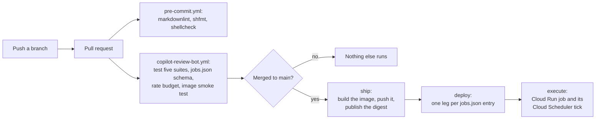

# ai-automation

A collection of AI automation tools for the XRP Ledger Foundation. Start here, then follow the link
for the tool you need.

## Layout

**One directory per tool, holding everything that tool owns**: the application, its tests, and how
it is deployed. Only repository-wide concerns live at the root: the lint configuration, the
pre-commit hooks, and `.github/workflows/`, which GitHub requires there.

```text
.
├── README.md                             You are here.
├── CONTRIBUTING.md                       Hooks, branches, and adding a tool.
├── .github/workflows/                    One workflow per tool, plus repo-wide linting.
└── [tool-name]/                          One tool, one directory.
    ├── README.md                         What the bot does and how to configure it.
    ├── [tool-name].sh                    The whole application.
    ├── deploy/README.md                  How it runs in production, and who may change it.
    └── tests/README.md                   How to verify a change, and how to debug one.
```

A tool is therefore added, read, or removed in one place. Nothing at the root has to be edited to
keep up with it.

## Tools

| Tool               | What it does                                                                                                                                                                                                                                                                                                                            | Read next                                                    |
|--------------------|-----------------------------------------------------------------------------------------------------------------------------------------------------------------------------------------------------------------------------------------------------------------------------------------------------------------------------------------|--------------------------------------------------------------|
| copilot-review-bot | Uses the `@xrplf-bot` account to request a GitHub Copilot review on a PR, but only when one is due. It waits for Copilot's earlier review threads to be resolved, and for a commit that is demonstrably new work. It runs as one Cloud Run job per watched repository, every 15 minutes, and keeps its state in a Cloud Storage bucket. | [copilot-review-bot/README.md](copilot-review-bot/README.md) |

## Where to start

Each document has one reader. Find yourself here rather than reading all five.

| You are                             | Read                                                                                                                                             |
|-------------------------------------|--------------------------------------------------------------------------------------------------------------------------------------------------|
| Changing what a bot decides         | the tool's README, then its `tests/README.md`                                                                                                    |
| Setting up accounts and permissions | [Set it up from scratch](copilot-review-bot/deploy/README.md#set-it-up-from-scratch), which orders the eight steps and links to each one         |
| On call for a tick that failed      | [the runbook](copilot-review-bot/deploy/README.md#runbook), then [what it logs](copilot-review-bot/README.md#what-it-logs)                       |
| Adding a watched repository         | [Add or change a watched repository](copilot-review-bot/deploy/README.md#add-or-change-a-watched-repository). One `jobs.json` entry and a merge. |
| New to the repository               | [CONTRIBUTING.md](CONTRIBUTING.md), then this page's layout section above                                                                        |

## How a change reaches production



One workflow per tool, named after it, so the list stays readable as more tools land here:

* **`pre-commit.yml`** runs the same hooks a developer runs locally, over everything. It is
  repository-wide rather than tied to one tool, so it carries no prefix, and it means CI and a
  developer's own hooks cannot drift apart. See
  [CONTRIBUTING.md](CONTRIBUTING.md#install-the-hooks).
* **`copilot-review-bot.yml`** is that tool's whole pipeline, in three jobs:
  * `test` runs the five suites on every event that touches the tool, validates its
    `deploy/jobs.json`, checks that the deployment fits in GitHub's hourly API quota, and smoke
    tests the image.
  * `ship` runs only on a push to `main`, and only if `test` passed. It builds the runtime image
    with the bot inside it, pushes it, and publishes the image digest for `deploy` to pin to.
  * `deploy` fans out over
    [`copilot-review-bot/deploy/jobs.json`](copilot-review-bot/deploy/jobs.json), one leg per
    watched repository, and reconciles each Cloud Run job and its schedule to match that file.

Because a tool owns one directory, each workflow triggers on one path glob (`copilot-review-bot/**`)
rather than a list of scattered paths that has to be kept in step with the layout.

A pull request therefore gets the tests and nothing else. Nothing that changes production can run
from one.

The image is the unit of deployment, and [How a change reaches
production](copilot-review-bot/deploy/README.md#how-a-change-reaches-production) explains what that
buys. Adding a repository is an entry in that tool's `deploy/jobs.json` and a merge.

## Working in this repository

[CONTRIBUTING.md](CONTRIBUTING.md) covers the pre-commit hooks, the branch and commit conventions,
and the checklist for adding a new tool. Install the hooks before your first commit.
