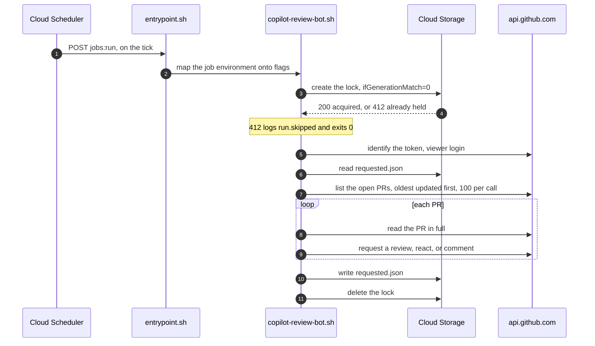
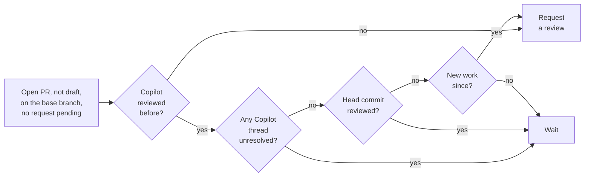
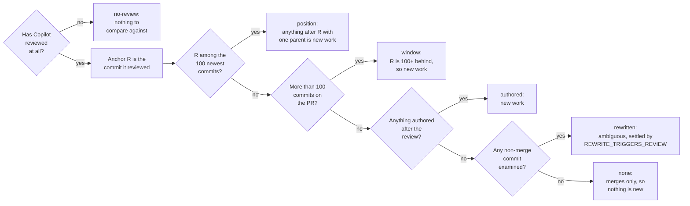
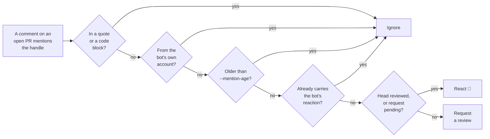
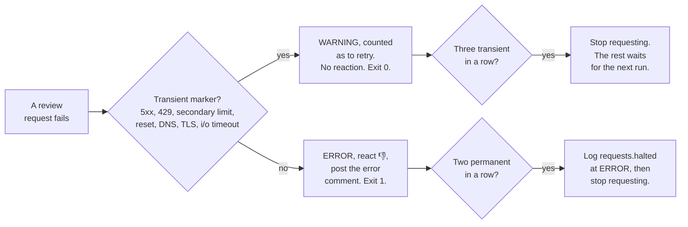
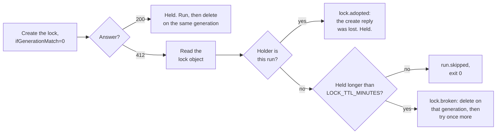

# copilot-review-bot

For the developer who has to maintain this bot, or explain a decision it made. It covers what the
bot does, when it acts, what it logs, and how to configure it.

How to test a change is in [tests/README.md](tests/README.md). How it runs in production is in
[deploy/README.md](deploy/README.md).

## What it does

The bot keeps GitHub Copilot reviews flowing on one repository. It requests a Copilot review when
one is due, and waits when one is not. One process watches one repository, so each watched
repository gets its own.

It is one bash script, driven by `gh` and `jq`, and it runs as a Cloud Run job about every 15
minutes. There is no webhook receiver and no inbound port. It keeps one small object in a Cloud
Storage bucket between runs. See [State and locking](#state-and-locking).

| Path                          | Purpose                                                                                                                                |
|-------------------------------|----------------------------------------------------------------------------------------------------------------------------------------|
| `copilot-review-bot.sh`       | The whole application.                                                                                                                 |
| [`deploy/`](deploy/README.md) | The image, the Cloud Run job, the tick, and the state bucket.                                                                          |
| [`tests/`](tests/README.md)   | The five suites and the harness they share.                                                                                            |
| `.dockerignore`               | Pares the image build context down to the two files the Dockerfile copies. It sits here because this directory *is* the build context. |

## Words used here

Each of these words means one thing, here and in [tests/README.md](tests/README.md) and
[deploy/README.md](deploy/README.md). Both of those link back to this table.

| Word               | Meaning                                                                   |
|--------------------|---------------------------------------------------------------------------|
| execution          | Cloud Run's own term for one container run of the job.                    |
| fleet              | Every job across every watched repository, taken together. Never one job. |
| PR                 | One GitHub pull request.                                                  |
| run                | One execution of the bot, start to exit.                                  |
| state root         | The directory or bucket URL under which the lock and the markers live.    |
| tick               | One firing of the Cloud Scheduler job that starts a run.                  |
| watched repository | The single repository one process monitors, named by `--repo`.            |

Three placeholders name the parts of a repository, and they are used the same way in every document
and every script here:

| Placeholder | Means                         | Example         |
|-------------|-------------------------------|-----------------|
| `<repo>`    | The whole thing, `owner/name` | `XRPLF/rippled` |
| `<owner>`   | The first half                | `XRPLF`         |
| `<name>`    | The second half               | `rippled`       |

`<repo>` is never one half. That keeps it agreeing with the five places the word already carries the
full slug: the `--repo owner/name` flag, the `REPO` environment variable, the `repo` field in
[`deploy/jobs.json`](deploy/jobs.json), the `repo` variable in the script, and the `repo` field on
every log line. `<owner>` and `<name>` match GitHub's own GraphQL parameters, which is why a path
built from them reads the same in the code as in the prose.

## Why the bot exists

GitHub does offer a native trigger: an organization or repository **branch ruleset** with
"Automatically request Copilot code review", plus sub-settings for new pushes and draft PRs. With
that option, every contributor needs an individual Copilot license, unless the organization enables
Copilot reviews for all organization members.

XRPLF developers are decentralized. Requiring a Copilot license from every contributor is
impractical, and so is making every contributor a member of the organization. So the `@xrplf-bot`
account holds a Copilot license, and it requests reviews on everyone's behalf.

The bot also gets to choose *when* to ask, which the native trigger cannot. It can:

* wait until every review thread Copilot opened is resolved,
* ignore a branch refresh, by requiring a non-merge commit,
* tell a restack from real work, using author dates rather than committer dates,
* backfill PRs that were already open when the policy was adopted,
* answer an `@xrplf-bot` mention on demand, including on drafts,
* bound the number of requests per run.

### Why polling

A webhook needs an inbound port, and opening a port to the outside world carries risk. The bot polls
GitHub instead. Every run is a fresh read of the current state.

The stored object is not a source of truth. A head-commit marker only covers the few minutes between
filing a review request and GitHub reporting it as pending. Every decision still comes from what
GitHub says now. Delete the stored object and the bot re-derives everything. The worst case is one
wasted API call.

That is what makes a run idempotent and crash-safe. If a run dies halfway, the next run continues
from where it left off.

### Why one process per repository

**One process watches exactly one repository.** Watching more repositories means running more copies
of it, which in production is one Cloud Run job each. That shape isolates failures, and it stops a
busy repository starving a quiet one under the per-run cap.

Two things follow:

* **They can all share one state root.** The bot puts its lock and its markers under
  `<owner>/<name>` inside whatever root it is given, so nothing per-process has to be kept unique by
  hand. See [State and locking](#state-and-locking).
* **The rate limit is per account, not per token or per process.** Every process using the same
  token, or a different token on the same GitHub account, draws on one budget of 5,000 points per
  hour. The fleet-wide arithmetic is in [Rate limit budget](deploy/README.md#rate-limit-budget).

## What one run does



Each PR is decided as soon as it is fetched, so output starts with the first PR rather than after
the last fetch. A run that prints nothing for minutes is stuck, not working.

The lock, the markers, and the deadline all exist to make a run safe to interrupt. The exit trap
releases the lock first and saves the markers second, because an unreleased lock costs the next tick
while a lost marker costs one wasted API call.

## Requirements

Every item is checked before any work starts, and a missing one is reported with an installation
hint. A missing dependency therefore never turns a scheduled run into a silent no-op.

| Requirement             | Notes                                                                                                                                                                                                                                      |
|-------------------------|--------------------------------------------------------------------------------------------------------------------------------------------------------------------------------------------------------------------------------------------|
| bash 4.4 or newer       | Earlier versions treat `"${empty_array[@]}"` as an unbound variable under `set -u`, and have no associative arrays. macOS still ships 3.2 as `/bin/bash`, so install a newer one with `brew install bash` and make sure it wins on `PATH`. |
| `gh`                    | Authenticated through `GH_TOKEN` or `GITHUB_TOKEN`.                                                                                                                                                                                        |
| `jq`                    | -                                                                                                                                                                                                                                          |
| `date`                  | GNU or BSD. The flavor is probed at startup.                                                                                                                                                                                               |
| `flock`                 | For a local state root only. From `util-linux` on Linux, `brew install flock` on macOS.                                                                                                                                                    |
| `curl`                  | For a `gs://` state root only.                                                                                                                                                                                                             |
| coreutils               | `mktemp`, `sed`, `grep`, `tr`, `head`, `tail`, `cat`, `cp`, `mv`, `rm`, `dirname`, `uname`. Present on any normal system, and checked anyway, so a stripped-down container names the missing one instead of failing mid-run.               |
| `timeout` or `gtimeout` | Also from coreutils. Optional: without it the run warns that `gh` calls are unbounded, and carries on.                                                                                                                                     |

## When it requests a review

**Automatic requests** apply only to PRs that are open, not draft, and target the repository's base
branch. That base is the default branch, or `--base BRANCH`. A PR that fails one of those, or that
already has a review request pending, is left alone.



Two of those gates need a definition:

* **Unresolved** counts only the threads Copilot opened. Human review threads are ignored. An
  outdated thread, whose code has since changed, still blocks unless `--ignore-outdated` is set.
* **New work** is at least one commit with exactly one parent since the commit Copilot reviewed. A
  merge commit has two parents, so pulling the base branch into the PR branch never triggers a
  review, while any real commit does.

Deciding the second one is the subtle part.

### How "new work" is established

The commit Copilot reviewed is the anchor. Every decision records how the question was answered as a
`basis`, on `pr.evaluated` and on whichever outcome event follows it, so a wrong call can be audited
without re-deriving it.



`basis` takes six values. Four of them are the real comparison. The other two are the trivial ends,
and both are common enough in the log to be worth recognizing: `no-review` rides on every first
review request, and `none` on a PR whose recent history is all merge commits.

**Request?** reads as "does this basis, on its own, file a review request". It assumes every earlier
gate already passed: the PR is open, not draft, targets the base branch, has no request pending, has
no unresolved Copilot thread, and its head commit is not already reviewed. Any one of those failing
means no request whatever the basis says.

| Basis       | When                                                                                                             | Request?                                       | Why                                                                                                                                                                                                |
|-------------|------------------------------------------------------------------------------------------------------------------|------------------------------------------------|----------------------------------------------------------------------------------------------------------------------------------------------------------------------------------------------------|
| `no-review` | Copilot has never reviewed this PR, so there is no anchor                                                        | **Yes**                                        | Not a comparison at all. Note that `new_work` is `false` on this path, because there is nothing to compare, and the request is filed anyway under `reason=never_reviewed`.                         |
| `position`  | The reviewed commit is still among the commits examined                                                          | **Yes**, if any commit after it is not a merge | The exact case. Every commit after the anchor is checked for having one parent. Yes on the first one that does, no when the only additions are merges.                                             |
| `window`    | The PR has more commits than the 100 examined, so the reviewed one fell off the end                              | **Yes**                                        | New work by definition: the reviewed commit is at least 100 commits behind the head, so the author dates must not get a say.                                                                       |
| `authored`  | The reviewed commit is absent, because the branch was rewritten, and something was **authored** after the review | **Yes**                                        | Unambiguous new work. This basis is only chosen when such a commit exists, so it never means no.                                                                                                   |
| `rewritten` | The reviewed commit is absent and nothing was authored after the review                                          | **No** by default                              | Ambiguous: indistinguishable from a bare restack, or from a `git commit --amend` that added real work but kept the original author date. `REWRITE_TRIGGERS_REVIEW=true` turns this row into a yes. |
| `none`      | The reviewed commit is absent, nothing was authored after it, and every commit examined is a merge commit        | **No**                                         | Merges only, so nothing is new. Logs `pr.skipped` with `reason=no_new_commits`.                                                                                                                    |

`window` exists because the reviewed commit is absent for two different reasons, and only one of
them is ambiguous. Treating both as a rewrite made a long-lived PR that repeatedly merges its base
branch skip forever. The window then holds only commits authored *before* the review, so the date
fallback answered no on every run. To illustrate, 20 of `XRPLF/rippled`'s 267 open PRs have more
than 100 commits, so this is not a corner case.

The author and committer distinction is the crux. A rebase stamps every commit it moves with a fresh
**committer** date and leaves the **author** date alone. Keying on committer dates therefore reports
the very commit Copilot already reviewed as brand new, and every restack triggers a fresh review. A
real PR in `XRPLF/rippled` was doing exactly that: a commit authored Aug 2, reviewed Aug 3,
restacked Aug 25 came back as "new since the review". Author dates make the restack case answerable.

The residual ambiguity is `rewritten`. The `git commit --amend` command keeps the original author
date, so an amend carrying real work is indistinguishable from a pure restack using metadata alone.
The default waits rather than re-reviewing on every rebase. Anyone who disagrees in a specific case
can mention `@xrplf-bot` on the PR. Setting `REWRITE_TRIGGERS_REVIEW=true` inverts the default
globally.

## Asking Copilot, by name

GitHub's REST "request reviewers" endpoint rejects bot accounts, and the GraphQL `requestReviews`
mutation takes `botIds`, not logins. So a node id is needed on the wire, and this script
deliberately does not know one. It runs:

```bash
gh pr edit <number> --repo <owner>/<name> --add-reviewer @copilot
```

`@copilot` is gh's documented alias for the Copilot reviewer, and gh resolves it through the
`requestReviewsByLogin` mutation. Three reasons make this the right layer for it:

* **A node id can change and a handle cannot.** GitHub owns the id. The login is the stable name.
  Every other Copilot test in this script already matches on the login, through `COPILOT_LOGINS`, so
  requesting by name makes the two consistent.
* **A stale id fails silently.** `requestReviews` accepts any well-formed id, so a wrong one
  succeeds, files the request against an account that reviews nothing, and leaves the PR looking
  reviewed-pending forever. A login that stops resolving is an error.
* **gh absorbs the churn.** If GitHub changes Copilot's account or the mutation, the fix is a `gh`
  upgrade rather than a patch here.

The cost is one extra API call per request, because gh looks the PR up before mutating.
`MAX_REQUESTS_PER_RUN` bounds it.

`--add-reviewer` is additive, so a PR's human reviewers are untouched. It also re-requests somebody
who has already reviewed, which is the whole point here.

`--reviewer` holds the value verbatim, exactly as `gh` wants it, and the default is `@copilot`.
Nothing in the script adds or strips the `@`, because the two kinds of reviewer are spelled
differently and no single rule fits both:

| Reviewer           | What `--add-reviewer` takes                                     | Why                                                                                                                          |
|--------------------|-----------------------------------------------------------------|------------------------------------------------------------------------------------------------------------------------------|
| A person or a team | The bare login or slug, such as `monalisa` or `myorg/team-name` | gh resolves it as an ordinary login.                                                                                         |
| Copilot            | The exact string `@copilot`                                     | It is a special value gh recognizes, not a login. There is no account named `copilot`, so the bare word resolves to nothing. |

Prepending `@` unconditionally would send `gh` `@monalisa`, which is not a login it can resolve.
Stripping it unconditionally would send `copilot`, which is not an account. So the setting carries
the spelling and the script carries no rule. `run.start` logs it, and because nothing rewrites it,
the log and the setting always agree.

`@copilot` is **not supported on GitHub Enterprise Server**, per gh's own documentation. Nothing
here targets GHES.

`--reviewer` is also the escape hatch if that alias is ever withdrawn. Nothing in production sets it
and no test can validate a login, since the suites stub `gh pr edit`, so treat any replacement
spelling as unconfirmed until a real request lands. The account behind the alias is a `Bot` whose
GraphQL login is `copilot-pull-request-reviewer`, and GitHub writes bot logins with a `[bot]` suffix
in other contexts, so the two forms are both candidates.

**Nothing here or in any suite can check that `@copilot` still resolves, or that GitHub still
re-requests an account that has already reviewed.** The suites stub `gh pr edit`. It is the one
assumption the whole tool rests on, and the only way to verify it is to watch a real request land.

## When somebody asks by name

A comment mentioning `@xrplf-bot`, configurable with `--mention-handle`, triggers a request on *any*
open PR. That includes drafts and PRs targeting other branches, which the automatic rules above both
exclude. Both PR conversation comments and inline review comments are scanned.

**Open is the one condition a mention cannot override.** A closed or merged PR is never touched, and
the state is checked before the mention is read, so no request, reaction or comment lands on one.
See [Known limitations](#known-limitations) for what that means for somebody who asks on a merged
PR.



The bot then reacts to the comment that asked:

| Reaction         | Meaning                                                                                                                          |
|------------------|----------------------------------------------------------------------------------------------------------------------------------|
| 👍 `THUMBS_UP`   | Copilot review requested                                                                                                         |
| 👎 `THUMBS_DOWN` | The request failed permanently. The error code and message are also posted as a PR comment, because a reaction cannot carry one. |
| 👀 `EYES`        | Acknowledged, nothing to do: Copilot already reviewed the current head commit, or a request is already pending.                  |
| none             | The outcome is not settled yet. See [When a request fails](#when-a-request-fails).                                               |

**The reaction doubles as the bookkeeping.** A comment already carrying one of those three reactions
*from the bot's own account* is skipped forever after, so no local state is needed to avoid
answering twice. A 👍 from a human does not count.

**A mention counts only where it could be a request.** Four kinds of text are stripped from a
comment body before the handle is looked for:

* **Block quotes**, so quoting somebody else's request does not re-fire it. Up to three leading
  spaces still count as a quote, which is what CommonMark says.
* **Fenced blocks**, opened with either three backticks or three tildes.
* **Indented code blocks**, meaning four or more leading spaces.
* **Inline code spans**, so a sentence explaining that you can ask the bot to re-review is
  documentation rather than a request.

The bot also ignores its own comments. Stripping is the safe direction, and it has one cost: see
[Known limitations](#known-limitations).

## When a request fails

A reaction is permanent, so the bot only uses one for an outcome that is permanent. Every failed
request is classified before the PR is touched.



| Class     | Examples                                                                          | Log                              | Mention                          | Exit |
|-----------|-----------------------------------------------------------------------------------|----------------------------------|----------------------------------|------|
| Transient | 5xx, 429, secondary rate limit, connection reset, DNS or TLS failure, i/o timeout | `WARNING`, counted as "to retry" | Left unreacted, retried next run | 0    |
| Permanent | 403 denied, 404, anything unrecognized                                            | `ERROR`                          | 👎 plus an error comment         | 1    |
| Deferred  | The per-run cap is reached                                                        | One `WARNING` for the run        | Left unreacted, retried next run | 0    |

Two details carry weight:

* **A secondary rate limit is a 403.** Classifying on the status code alone would call that
  permanent, thumb the comment down, and swallow somebody's request forever over a wait of a few
  minutes. Transient markers are therefore tested first, and a 4xx does not veto them.
* **Anything unrecognized is permanent.** Surfacing an unknown error once, loudly, beats retrying it
  silently every 15 minutes with nobody any the wiser.

Set `TRANSIENT_FAILURES_ARE_ERRORS=true` if you would rather a transient failure also failed the
run.

### Circuit breakers

Three breakers exist for one reason: a failure that is going to repeat should not be repeated once
per open PR.

| Breaker                         | Default | What it stops                                                                                                                                                                                     |
|---------------------------------|---------|---------------------------------------------------------------------------------------------------------------------------------------------------------------------------------------------------|
| `MAX_CONSECUTIVE_TRANSIENT`     | 3       | The run stops requesting and leaves the rest to the next one. If GitHub is having a bad minute, there is no point walking the remaining PRs one 502 at a time.                                    |
| `MAX_CONSECUTIVE_PERMANENT`     | 2       | The same, plus `requests.halted` at `ERROR`. A permanent failure on a review request is almost always a repository-wide fact, such as the token losing the Triage role or Copilot having no seat. |
| `MAX_CONSECUTIVE_READ_FAILURES` | 3       | The sweep is abandoned. Each failed read has already cost three attempts and nine seconds of backoff, so continuing would outlast any sane task timeout.                                          |

Every attempt counts against `--max-requests`, not just the successful ones, and
`SLEEP_BETWEEN_MUTATIONS` applies to every mutation on both outcomes. GitHub's secondary limits
count what you send, not what worked.

`MAX_CONSECUTIVE_PERMANENT` guards reactions as well as requests. Two permanent reaction failures in
a row stop the run writing any more of them, and `mention.writes_halted` then carries
`reason=permanent_failures` rather than `write_cap`. A reaction failure is nearly always
repository-wide too, such as a token that has lost `Issues: Read and write`.

### Exit status

| Code       | Meaning                                                                                                                                                                                                  |
|------------|----------------------------------------------------------------------------------------------------------------------------------------------------------------------------------------------------------|
| 0          | Nothing failed. **A run with nothing to do exits 0**, so a repository whose PRs are all up to date is a success, not a warning. A lock held by a live run is also 0, because being late is not an error. |
| 1          | Something the run should have done did not happen.                                                                                                                                                       |
| 2          | Fatal: the run could not start, or could not continue. See [the `run.fatal` reasons](#why-a-run-could-not-start-runfatal).                                                                               |
| 143 or 130 | Killed by `SIGTERM` or `SIGINT`.                                                                                                                                                                         |

Exiting 1 covers a permanent error on a PR, a repository that could not be listed at all, and a
sweep abandoned after repeated read failures. Every one of them logs an `ERROR` event, so the exit
code never disagrees with the log. A **transient** failure on one PR exits 0, because the next run
retries it. Set `TRANSIENT_FAILURES_ARE_ERRORS=true` if your alerting wants to know about those too.

An idle run is the normal steady state. It logs `run.done` at `INFO` with `requests_filed: 0`, which
is the number to watch on a dashboard rather than to alert on. What deserves an alert is the absence
of `run.done` altogether. See [Monitoring and alerting](deploy/README.md#monitoring-and-alerting).

## The per-run cap and the PR order

`--max-requests`, default 25, bounds how many review requests one run files. When the cap is reached
the run **stops**. The remaining PRs are not fetched, because the only thing left to do with them is
to defer them, at one API call each.

The PR list is ordered oldest-updated first, so the request budget goes to the real backlog before
anything else.

Newest first sounds more responsive, but requesting a review is itself an update. It bumps the PR to
the front of that ordering on the very next run, with nothing left to do but confirm the request is
still pending. Newest-first would spend the start of every run re-reading PRs it had already
serviced, before it ever reached PRs it had not. Oldest-first avoids that: a serviced PR's bumped
`updatedAt` pushes it toward the *back* of the queue.

The tradeoff is that a PR with a brand-new commit gets no special priority. It is checked in
whatever position its `updatedAt` puts it, the same as anything else. Raise `--max-requests` if the
resulting wait for the tail of the backlog is longer than you want. Bear in mind that the budget is
shared with every other process on the same account.

### A dry run measures the backlog, it does not preview the next run

`--dry-run` **ignores the cap**, deliberately. The cap exists to bound mutations, both against a
storm on day one and against GitHub's secondary rate limits, and a dry run makes no mutations at
all. Stopping at the cap would also destroy what a dry run is for: a dry run that halted after 25
could only ever report "at least 25", which is the question you were asking.

So a dry run walks every open PR and counts everything that is due. `run.done` reports both numbers,
because the total on its own reads as a prediction and is not one:

| Field                 | Means                                                                                     |
|-----------------------|-------------------------------------------------------------------------------------------|
| `would_file`          | The whole outstanding backlog. How far behind the repository is.                          |
| `would_file_next_run` | What a real run would file before the cap stopped it. Never higher than `--max-requests`. |

Both are on every `run.done`, including a live run, where they are 0. A field that appeared only
sometimes could not carry a Cloud Logging metric.

**A dry run costs a real run's worth of quota.** It reads every PR at 2 points each, so
`XRPLF/rippled` at about 267 open PRs is roughly 538 points, near 11% of the hourly 5,000. That is
on top of whatever the scheduled fleet already spends, which is the figure in [Rate limit
budget](deploy/README.md#rate-limit-budget). Two or three dry runs while debugging can push the
total over, and the symptom lands on the *scheduled* runs rather than on yours: they start failing
reads with `pr.read_failed`, then stop with `reason=read_failures`. Use `--pr N` when one PR is the
question.

## State and locking

One thing has to survive between runs:

* `requested.json` holds `{"<owner>/<name>#<pr>": {"head": ..., "at": ...}}`, the head commit each
  request was filed for. It guards against a double request in the window before GitHub reports the
  pending review request. Entries older than `MARKER_MAX_AGE_DAYS`, default 90, are dropped on
  write.

One object rather than one file per PR is deliberate. A few hundred marker objects would mean a few
hundred GETs per run against a repository the size of `XRPLF/rippled`. One object means one read at
startup and one write at the end.

Set `STATE_DIR` to either:

* a **local path**, which locks with `flock` on the lock file, or
* **`gs://bucket`, with an optional `/prefix`**, which needs no credentials of its own. On Cloud Run
  the script asks the instance metadata server for a short-lived token for the attached service
  account, so whatever IAM you granted that account is what applies. There is no key file and
  nothing to rotate. The script creates, reads and deletes objects, which is what the role it needs
  has to allow: see [Identities and permissions](deploy/README.md#identities-and-permissions).

The prefix is optional, and production leaves it out: `deploy-job.sh` sets the bare bucket root. A
trailing slash is stripped either way, and a multi-segment prefix works, so `gs://b`, `gs://b/`, and
`gs://b/a/b/c` are all valid. Only `gs://` with no bucket is refused, with `reason=bad_state_dir`.

The bot appends the repository it is watching to the state directory, so both files live under
`${STATE_DIR}/<owner>/<name>/`, for instance:

```text
${STATE_DIR}/XRPLF/rippled/lock
${STATE_DIR}/XRPLF/rippled/requested.json
```

The production root, and what the deployed jobs set it to, are in [State lives in a
bucket](deploy/README.md#state-lives-in-a-bucket-not-in-tmp).

That is what lets every single-repository process share one root. The repository namespaces the
state, so there is no per-process prefix to choose, and no way to collide by choosing the same one
twice. Two processes on the *same* repository still contend for that one lock, which is the intended
reading of it: they would be duplicating each other's work.

Deleting the state is safe. Worst case the bot re-files one request for a PR whose pending state has
not yet materialized, and an additive review request treats that as a no-op. Moving `STATE_DIR` has
the same effect. The new path is empty, so the first run there re-derives everything.

### The lock

A run that overlaps its predecessor would decide on stale state. With shared state it would also
drop the other run's markers when it writes.

`flock` is enough for a local state root. It is useless between two Cloud Run executions, which
share no kernel. So a `gs://` state root locks with an object instead. The run creates its `lock`
with an `ifGenerationMatch=0` precondition, which fails with 412 if anybody already holds it. The
lock is per repository, like the markers beside it, so two processes watching different repositories
never wait on each other.

A 412 has three possible meanings, and the run tells them apart by reading the object:



A second live run therefore logs `run.skipped` and exits 0, because being late is not an error. The
other two paths matter less often and are worth knowing anyway:

* **Adopted.** A creation whose response was lost, to a 503 or a dropped connection, retries into
  its own object and gets 412. Read as somebody else's lock, that would make the run skip itself and
  leave a lock nobody releases until the TTL.
* **Broken.** A lock older than `LOCK_TTL_MINUTES`, default 30, is treated as abandoned. A killed
  execution therefore cannot wedge the schedule forever. The break is itself conditional on the
  generation that was read, so two runs racing to break the same stale lock cannot both win. A lock
  whose body records no start time cannot be aged, so it is broken rather than respected: an
  unageable lock would wedge the schedule permanently rather than for one TTL.

Set `LOCK_TTL_MINUTES` just above whatever kills a run from the outside, such as a Cloud Run
`--task-timeout`. Below that, a slow but healthy run gets its lock stolen and two runs work at once.
Far above it, a killed run blocks every tick until the window expires.

## What it logs

One line per event. In `json` mode, the default, that is one JSON object per line. Cloud Logging
recognizes `severity`, `message` and `time` and promotes them onto the log entry. Everything else
lands in `jsonPayload`. `event`, `repo` and `pr` are also copied into
`logging.googleapis.com/labels`, so they can be filtered as labels. For example:

```json
{"time":"2026-08-28T20:20:02.080Z","severity":"WARNING","event":"repo.stopped",
 "message":"stopping early: the run limit of 25 review requests is reached",
 "repo":"XRPLF/rippled","reason":"run_limit","inspected":25,"total":263,
 "remaining":238,"limit":25,
 "logging.googleapis.com/labels":{"event":"repo.stopped","repo":"XRPLF/rippled"}}
```

Numbers and booleans are emitted as JSON numbers and booleans, not strings, so Cloud Logging can
filter and build metrics on them arithmetically. Every value that reaches the log that way is
validated at startup, including `--pr`, so a bad option produces a clear complaint rather than a
line no JSON parser will accept.

Nothing else writes to the stream. A raw `gh` error, a jq error and a shell redirect error are all
captured and re-emitted as events, so the one-object-per-line contract holds even on the failure
paths. Everything goes to stdout, deliberately: one stream keeps events in order, and severity
rather than the choice of stream is what marks a problem.

`--log-format text` renders the same events as logfmt, for reading in a terminal.

### The two terminal events

`run.done` and `run.aborted` are the only terminal events, so **the absence of either is the signal
to alert on**.

`run.aborted` is emitted from the signal trap, with `reason=signal`, and from the error trap, with
`reason=unexpected_error`. Without it, an aborted run is indistinguishable from one that never
started, because the log simply stops. The error trap needs `set -E`, since bash does not inherit an
`ERR` trap into function bodies without it, and almost everything here runs inside one.

Every event that reports stopping early carries a `reason`, and it names the real cause. The request
cap, the read-failure breaker (`read_failures`) and the run deadline (`run_deadline`) are
distinguishable rather than all reported as the cap. `run.done` repeats it as `stop_reason`.

### Why a run could not start: `run.fatal`

`run.fatal` is the only event on the exit-2 path, and `reason` is the field that says what to do
about it. There are sixteen values, grouped: the first six are a bad setting, the next three an
unusable machine, then two a credential, then four a state root that could not be used, and the last
one a bug. None of them reached the point of deciding anything about a PR.

| Reason                  | What happened                                                                                                                                        | What to do                                                                                 |
|-------------------------|------------------------------------------------------------------------------------------------------------------------------------------------------|--------------------------------------------------------------------------------------------|
| `bad_option`            | An unknown option, an option missing its value, or a setting that failed validation. Carries `setting` and `given`.                                  | Fix whatever `setting` names, as a flag or as an environment variable.                     |
| `bad_log_format`        | `--log-format` was neither `json` nor `text`.                                                                                                        | Use one of the two.                                                                        |
| `invalid_reviewer`      | `--reviewer` or `REVIEWER` is empty. Every request would fail the same way, once per PR.                                                             | Give it a value, or leave it unset for `@copilot`.                                         |
| `bad_repo`              | The repository is not `owner/repo`. Carries `given`.                                                                                                 | Fix the spelling. One slash, and neither half empty.                                       |
| `no_repos`              | No repository was named. The usage block follows the event.                                                                                          | Pass `--repo owner/repo`, or set `REPO`.                                                   |
| `bad_state_dir`         | `STATE_DIR` starts with `gs://` and names no bucket.                                                                                                 | Name the bucket.                                                                           |
| `bash_too_old`          | bash is older than 4.4. Written out by hand, because `emit` itself needs 4.4.                                                                        | Install a newer bash and make sure it wins on `PATH`.                                      |
| `missing_prerequisites` | A required program is absent. Carries `missing`, and one `run.prerequisite_missing` follows per program with an install hint.                        | Install what it names.                                                                     |
| `unusable_date`         | Neither `date -d` nor `date -v` works, so relative dates cannot be computed.                                                                         | Install GNU or BSD `date`.                                                                 |
| `no_credentials`        | No `GH_TOKEN`, no `GITHUB_TOKEN`, and `gh` is not logged in.                                                                                         | In production this is the `gh-token` secret. See the [runbook](deploy/README.md#symptoms). |
| `viewer_unknown`        | GitHub did not name the account behind the token. Either the call failed, and `error` and `failure_class` say how, or it answered with no login.     | A transient `failure_class` means try again. Otherwise replace the token.                  |
| `state_bucket_unusable` | The lock could not be written, so the run cannot prove it is alone. Carries the bucket, the HTTP status and the service account.                     | 403 is a missing `roles/storage.objectAdmin`. 404 is a bucket that does not exist.         |
| `state_dir_unwritable`  | The local state directory could not be created.                                                                                                      | Check the path and its permissions.                                                        |
| `lock_unwritable`       | The local lock file could not be created. Carries `lock_file`.                                                                                       | Check that the state directory exists and is writable.                                     |
| `flock_unusable`        | `flock` could not be executed, so the run refused to proceed unlocked. Exit 127 from `flock` is otherwise indistinguishable from "the lock is held". | Reinstall `util-linux`, or `flock` on macOS.                                               |
| `internal`              | A bug: a relative date was requested before the `date` flavor was probed.                                                                            | Nothing an operator can fix. Report it.                                                    |

One other event ends a run at exit 2 with no `run.fatal` beside it: `gcs.no_token`, when no Google
access token could be obtained from the metadata server.

### Event reference

`DEBUG` events appear only under `-v`. Seven events carry two severities, and the rule is the same
in every case: the higher one fires when the run needs somebody to look. The condition is in the
row.

**The order is deliberate, and it is not alphabetical.** Events are grouped by prefix, in the order
a run reaches them: the run itself, then the repository, then one PR, then what it decided, then the
lock and the state it leaves behind. Within a group the ordinary path comes before the failures, so
`run.start` precedes `run.fatal`. Somebody who already knows the event name can search for it;
somebody who does not is better served by finding it beside its neighbours than by meeting
`comment.failed` first.

| Event                         | Severity                                                       | Meaning                                                                                                                                                                                                                                                          |
|-------------------------------|----------------------------------------------------------------|------------------------------------------------------------------------------------------------------------------------------------------------------------------------------------------------------------------------------------------------------------------|
| `run.start`                   | INFO                                                           | The run began. Carries the version, the viewer login, the reviewer actually sent, and every headline setting.                                                                                                                                                    |
| `run.done`                    | INFO, else ERROR when the run exits non-zero                   | The run finished. The severity matches the exit status, so a run that reports failure never opens with the word "done". Carries `requests_filed`, and on a dry run `would_file` and `would_file_next_run`.                                                       |
| `run.aborted`                 | ERROR                                                          | A signal or an unexpected error ended the run early.                                                                                                                                                                                                             |
| `run.skipped`                 | INFO                                                           | Another run holds the lock. Exit 0.                                                                                                                                                                                                                              |
| `run.fatal`                   | ERROR                                                          | The run could not start or could not continue. See [the sixteen reasons](#why-a-run-could-not-start-runfatal).                                                                                                                                                   |
| `run.prerequisite_missing`    | ERROR                                                          | A required program is absent. Carries an installation hint.                                                                                                                                                                                                      |
| `run.no_gh_timeout`           | WARNING                                                        | Neither `timeout` nor `gtimeout` is on `PATH`, so `gh` calls are unbounded.                                                                                                                                                                                      |
| `repo.start`                  | INFO                                                           | The sweep began. Carries the base branch and `open_prs`, the true open PR count.                                                                                                                                                                                 |
| `repo.more_prs_than_expected` | WARNING                                                        | The repository has more open PRs than `EXPECTED_OPEN_PRS`, which is the figure the deployment budgets the API quota at. Once per run. Only under-declaring warns.                                                                                                |
| `repo.progress`               | INFO                                                           | Heartbeat, every `PROGRESS_EVERY` PRs on a non-verbose run.                                                                                                                                                                                                      |
| `repo.done`                   | INFO                                                           | The sweep finished.                                                                                                                                                                                                                                              |
| `repo.stopped`                | WARNING                                                        | The sweep stopped early. Carries the `reason`.                                                                                                                                                                                                                   |
| `repo.list_failed`            | ERROR                                                          | The PR list could not be read, paged, or parsed.                                                                                                                                                                                                                 |
| `repo.read_failed`            | ERROR                                                          | The repository itself could not be read.                                                                                                                                                                                                                         |
| `repo.no_base_branch`         | ERROR                                                          | The base branch could not be determined.                                                                                                                                                                                                                         |
| `repo.no_matching_base`       | WARNING                                                        | Every open PR targets a different branch, so nothing can ever be requested. Check `--base`.                                                                                                                                                                      |
| `pr.fetching`                 | DEBUG                                                          | About to read one PR.                                                                                                                                                                                                                                            |
| `pr.evaluated`                | DEBUG                                                          | The full decision record for one PR.                                                                                                                                                                                                                             |
| `pr.evaluate_failed`          | ERROR                                                          | The PR payload could not be evaluated.                                                                                                                                                                                                                           |
| `pr.skipped`                  | DEBUG, else INFO for `reason=not_open`                         | The PR needs nothing, with the reason. Routine skips are DEBUG, because a quiet run would otherwise log one per PR. `not_open` is only reachable through `--pr`, where somebody asked about that one PR by hand and must see the answer without `-v`.            |
| `pr.read_failed`              | WARNING for a transient failure, ERROR for a permanent one     | One PR could not be read. Classified exactly like a failed request, because the exit status follows the same rule: a transient read is retried next run, a permanent one is not.                                                                                 |
| `pr.read_unexpected`          | ERROR                                                          | The response carried no `pullRequest` object: the PR is gone, or the repository was renamed mid-run.                                                                                                                                                             |
| `pr.mentions_failed`          | ERROR                                                          | The PR could not be scanned for mentions.                                                                                                                                                                                                                        |
| `pr.base_gate_bypassed`       | INFO                                                           | `--pr` named a PR that targets another branch, so the base gate was skipped.                                                                                                                                                                                     |
| `review.requested`            | INFO                                                           | A review request was filed.                                                                                                                                                                                                                                      |
| `review.deferred`             | WARNING the first time in a run, DEBUG after that              | The request was left for the next run. The run announces hitting its budget once, then stops repeating it, so a backlog of 200 deferred PRs is one WARNING rather than 200.                                                                                      |
| `review.request_failed`       | WARNING for a transient failure, ERROR for a permanent one     | See [When a request fails](#when-a-request-fails). A transient failure exits 0, so it must not log at ERROR.                                                                                                                                                     |
| `requests.halted`             | WARNING for the transient breaker, ERROR for the permanent one | A breaker stopped further requests. Consecutive transient failures mean GitHub is having a bad minute, and the next run retries. Consecutive permanent ones are almost always repository-wide, such as a lost Triage role, and nothing improves without a human. |
| `reads.halted`                | ERROR                                                          | The read-failure breaker abandoned the sweep.                                                                                                                                                                                                                    |
| `mention.answering`           | DEBUG                                                          | A mention is being answered.                                                                                                                                                                                                                                     |
| `mention.no_action`           | DEBUG                                                          | A mention needs no action, with the reason.                                                                                                                                                                                                                      |
| `mention.writes_halted`       | WARNING                                                        | No further reactions or error comments will be written this run. `reason` says which limit stopped it: `write_cap` for `MAX_MENTION_WRITES_PER_RUN`, or `permanent_failures` for two permanent reaction failures in a row.                                       |
| `reaction.added`              | INFO                                                           | A reaction was added. Carries the comment id.                                                                                                                                                                                                                    |
| `reaction.exists`             | DEBUG                                                          | The reaction was already present.                                                                                                                                                                                                                                |
| `reaction.failed`             | WARNING for a transient failure, ERROR for a permanent one     | The reaction could not be added. The permanent case also sets the exit status, so the one line describing what to look at must not be a WARNING while the run reports failure. A missing `Issues: Read and write` lands here.                                    |
| `comment.posted`              | INFO                                                           | An error comment was posted.                                                                                                                                                                                                                                     |
| `comment.failed`              | WARNING                                                        | The error comment could not be posted.                                                                                                                                                                                                                           |
| `lock.acquired`               | DEBUG                                                          | The lock is held by this run.                                                                                                                                                                                                                                    |
| `lock.skipped`                | DEBUG                                                          | A dry run makes no writes, so it takes no lock.                                                                                                                                                                                                                  |
| `lock.broken`                 | WARNING                                                        | A lock older than its TTL was treated as abandoned and removed.                                                                                                                                                                                                  |
| `lock.adopted`                | WARNING                                                        | This run had already created the lock, so its create response was lost. Adopted rather than skipped.                                                                                                                                                             |
| `lock.release_failed`         | WARNING                                                        | The lock could not be released. It expires after its TTL.                                                                                                                                                                                                        |
| `lock.release_unconditional`  | WARNING                                                        | The generation was never learned, so the lock was released without a precondition rather than left behind.                                                                                                                                                       |
| `state.loaded`                | DEBUG                                                          | The markers were read.                                                                                                                                                                                                                                           |
| `state.saved`                 | DEBUG                                                          | The markers were written.                                                                                                                                                                                                                                        |
| `state.ephemeral`             | WARNING                                                        | The state root is local on a platform with a fresh filesystem per execution, so markers are lost.                                                                                                                                                                |
| `state.read_failed`           | WARNING                                                        | The marker object could not be read.                                                                                                                                                                                                                             |
| `state.unreadable`            | WARNING                                                        | The stored markers are not a JSON object and are being ignored. At worst one extra request per PR.                                                                                                                                                               |
| `state.write_failed`          | ERROR                                                          | The markers could not be written.                                                                                                                                                                                                                                |
| `state.write_skipped`         | WARNING                                                        | The stored markers could not be read this run, so they are left alone rather than replaced.                                                                                                                                                                      |
| `state.write_conflict`        | WARNING                                                        | Another run published markers first, so the two sets are merged and the write retried.                                                                                                                                                                           |
| `gcs.retry`                   | DEBUG                                                          | A Cloud Storage call is being retried.                                                                                                                                                                                                                           |
| `gcs.no_token`                | ERROR                                                          | No Google access token could be obtained from the metadata server.                                                                                                                                                                                               |
| `gh.error`                    | DEBUG                                                          | The raw `gh` error for a failed call.                                                                                                                                                                                                                            |

When a repository read fails, the `access.*` family carries the diagnosis and a `remedy` code. These
are the only events that say *why* a token stopped working, so a token rotation gone wrong is
diagnosed by filtering on them.

| Event                     | Diagnosis                                                                                                                                                                                                                                               |
|---------------------------|---------------------------------------------------------------------------------------------------------------------------------------------------------------------------------------------------------------------------------------------------------|
| `access.token_rejected`   | The token itself is not valid.                                                                                                                                                                                                                          |
| `access.sso_required`     | The token needs SAML SSO authorization for the organization.                                                                                                                                                                                            |
| `access.denied`           | The token is valid but not permitted on this repository.                                                                                                                                                                                                |
| `access.fine_grained_pat` | A fine-grained PAT that was never granted this repository, which is deny-by-default even for public ones.                                                                                                                                               |
| `access.anonymous_probe`  | What an anonymous client sees for the same repository, which separates a token problem from a repository problem. Every one of these is ERROR, except an inconclusive probe, which is DEBUG: it answers nothing, and `conclusion=inconclusive` says so. |

`remedy` is not confined to that family. Seven events carry one, and it always names the fix rather
than the fault, so a filter on `remedy` finds every event somebody can act on:

| Event                                       | `remedy`                       |
|---------------------------------------------|--------------------------------|
| `access.token_rejected`                     | `replace_token`                |
| `access.sso_required`                       | `authorize_sso`                |
| `access.fine_grained_pat`                   | `grant_repo_or_public_read`    |
| `run.fatal`, `reason=state_bucket_unusable` | `grant_storage_objectAdmin`    |
| `run.no_gh_timeout`                         | `install_coreutils`            |
| `requests.halted`, the permanent breaker    | `check_token_and_copilot_seat` |
| `state.ephemeral`                           | `use_gcs_state_dir`            |

## Options

Given twice, the last wins. There are no positional arguments.

**A flag and its environment variable are not always spelled the same.** Five of the eight pairs
below match exactly. The other three differ the same way: the flag leaves out what its own argument
placeholder already says, and what one invocation makes obvious anyway.

| Flag                 | Variable               | What the flag leaves out                                         |
|----------------------|------------------------|------------------------------------------------------------------|
| `--state DIR`        | `STATE_DIR`            | `DIR`, which the placeholder states                              |
| `--mention-age DAYS` | `MENTION_MAX_AGE_DAYS` | `MAX` and `DAYS`                                                 |
| `--max-requests N`   | `MAX_REQUESTS_PER_RUN` | `PER_RUN`: a command you typed is one run, so it needs no saying |

The variable keeps the longer name because it does need saying there. A variable set on a Cloud Run
job outlives every run it configures, so `PER_RUN` is what distinguishes a per-run cap from a total.
`deploy/jobs.json` follows the variable rather than the flag, and [its field names are the variables
lowercased](deploy/README.md#add-or-change-a-watched-repository).

| Option                  | Env                    | Default                                                            | Notes                                                                                                                                                                                                                                                                                                                      |
|-------------------------|------------------------|--------------------------------------------------------------------|----------------------------------------------------------------------------------------------------------------------------------------------------------------------------------------------------------------------------------------------------------------------------------------------------------------------------|
| `-r, --repo owner/name` | `REPO`                 | required                                                           | The one repository this process watches. `REPO` is used only when no `--repo` is given.                                                                                                                                                                                                                                    |
| `--base BRANCH`         | -                      | the repository's default branch                                    | Gate for automatic requests.                                                                                                                                                                                                                                                                                               |
| `--state DIR`           | `STATE_DIR`            | `${XDG_STATE_HOME:-${HOME:-/tmp}/.local/state}/copilot-review-bot` | Local path, or `gs://bucket` with an **optional** `/prefix`. `XDG_STATE_HOME` is unset on a stock machine, so this is normally `~/.local/state/copilot-review-bot`, and `/tmp/.local/state/...` with no `HOME` either.                                                                                                     |
| `--reviewer NAME`       | `REVIEWER`             | `@copilot`                                                         | Who the review is requested from, spelled exactly as `gh pr edit --add-reviewer` wants it. **Keeps a leading `@` for Copilot**, because that is gh's own special value. A person or team is bare: `monalisa`, `myorg/team-name`. Only checked for being non-empty. See [Asking Copilot, by name](#asking-copilot-by-name). |
| `--mention-handle NAME` | `MENTION_HANDLE`       | `xrplf-bot`                                                        | The login the bot answers to in comment bodies. **Refuses a leading `@`**, and must be letters, digits and hyphens. The bot adds the `@` when it searches.                                                                                                                                                                 |
| `--mention-age DAYS`    | `MENTION_MAX_AGE_DAYS` | `7`                                                                | Ignore older comments. Keeps the first run from replying to years of history.                                                                                                                                                                                                                                              |
| `--max-requests N`      | `MAX_REQUESTS_PER_RUN` | `25`                                                               | The run stops when it is reached. See [The per-run cap](#the-per-run-cap-and-the-pr-order).                                                                                                                                                                                                                                |
| `--ignore-outdated`     | `IGNORE_OUTDATED`      | `false`                                                            | Treat outdated Copilot threads as resolved.                                                                                                                                                                                                                                                                                |
| `--log-format FMT`      | `LOG_FORMAT`           | `json`                                                             | `json` or `text`.                                                                                                                                                                                                                                                                                                          |
| `--pr N`                | -                      | -                                                                  | Debug a single PR.                                                                                                                                                                                                                                                                                                         |
| `-n, --dry-run`         | -                      | -                                                                  | Decide and log, change nothing **on GitHub**, and take no lock, local or `gs://`. Walks every PR, because the cap never moves, so `would_file` is the whole backlog and not a prediction. See [A dry run measures the backlog](#a-dry-run-measures-the-backlog-it-does-not-preview-the-next-run).                          |
| `-v, --verbose`         | -                      | -                                                                  | Emit `DEBUG` events too: every PR including skips, with the reason.                                                                                                                                                                                                                                                        |
| `--explain FILE`        | -                      | -                                                                  | Run the decision rules over a saved `pullRequest` object and print the result. See [tests/README.md](tests/README.md#debug-one-pr-with---explain).                                                                                                                                                                         |
| `--version`             | -                      | -                                                                  | Print the version, also a `version` field on `run.start`, and exit 0.                                                                                                                                                                                                                                                      |
| `-h, --help`            | -                      | -                                                                  | Print the usage block and exit 0.                                                                                                                                                                                                                                                                                          |

### Caps, breakers and pacing

| Variable                        | Default | Meaning                                                                                                                                                                                                                                                     |
|---------------------------------|---------|-------------------------------------------------------------------------------------------------------------------------------------------------------------------------------------------------------------------------------------------------------------|
| `MAX_MENTION_WRITES_PER_RUN`    | `50`    | Reactions and error comments the run may write in total. `--max-requests` bounds review requests only, and one heavily discussed PR can carry hundreds of mentions. The remainder is left unreacted, which is the state the next run treats as outstanding. |
| `MAX_CONSECUTIVE_TRANSIENT`     | `3`     | Transient request failures in a row before the run stops requesting.                                                                                                                                                                                        |
| `MAX_CONSECUTIVE_PERMANENT`     | `2`     | Permanent request failures in a row before the run stops requesting. It bounds permanent **reaction** failures the same way, and separately, before the run stops writing those. See [Circuit breakers](#circuit-breakers).                                 |
| `MAX_CONSECUTIVE_READ_FAILURES` | `3`     | Failed PR reads in a row before the sweep is abandoned.                                                                                                                                                                                                     |
| `RUN_DEADLINE_SECONDS`          | `900`   | Wall-clock budget, checked between PRs. `0` disables. Keep it below the platform's task timeout: stopping voluntarily costs one tick, being killed also costs the lock.                                                                                     |
| `SLEEP_BETWEEN_MUTATIONS`       | `1`     | Seconds between mutations, on both outcomes. Eases GitHub's secondary rate limits.                                                                                                                                                                          |
| `PROGRESS_EVERY`                | `25`    | Heartbeat interval in PRs for non-verbose runs. `0` disables. Verbose runs log every PR instead.                                                                                                                                                            |

### Timeouts and retries

| Variable                                      | Default     | Meaning                                                                                                                                                                               |
|-----------------------------------------------|-------------|---------------------------------------------------------------------------------------------------------------------------------------------------------------------------------------|
| `GH_TIMEOUT`                                  | `60`        | Seconds per `gh` call, applied with `timeout(1)`, because `gh` has no timeout of its own. `0` disables.                                                                               |
| `GH_MAX_ATTEMPTS` / `GH_RETRY_BASE_SECONDS`   | `3` / `3`   | Attempts per read, and the linear backoff base. Attempt 1 waits 1x and attempt 2 waits 2x, so a failed read costs 9s by default. That is what `MAX_CONSECUTIVE_READ_FAILURES` bounds. |
| `GCS_HTTP_TIMEOUT` / `GCS_TOKEN_TIMEOUT`      | `60` / `10` | Seconds per Cloud Storage call and per metadata-server call.                                                                                                                          |
| `GCS_MAX_ATTEMPTS` / `GCS_RETRY_BASE_SECONDS` | `3` / `2`   | Attempts per Cloud Storage call, retried on `000`, 429 and 5xx, and the linear backoff base for them. The default costs 6s across the three attempts. `0` retries immediately.        |
| `CLEANUP_HTTP_TIMEOUT`                        | `3`         | Seconds per call once the exit trap is running, which has only the platform's shutdown grace period to work in.                                                                       |

### State and credentials

| Variable                    | Default                            | Meaning                                                                                                                                |
|-----------------------------|------------------------------------|----------------------------------------------------------------------------------------------------------------------------------------|
| `LOCK_FILE`                 | `${STATE_DIR}/<owner>/<name>/lock` | Local state only. An explicit value is used as given, without the per-repository nesting.                                              |
| `LOCK_TTL_MINUTES`          | `30`                               | `gs://` state only. When an unreleased lock is treated as abandoned. Set it just above your task timeout.                              |
| `MARKER_MAX_AGE_DAYS`       | `90`                               | How long a head-commit marker is kept.                                                                                                 |
| `GOOGLE_OAUTH_ACCESS_TOKEN` | -                                  | A Google access token, for driving a `gs://` state root from outside Cloud Run. There is no fallback to your `gcloud` login.           |
| `GOOGLE_SERVICE_ACCOUNT`    | the metadata server                | The account name used in a Cloud Storage permission error. Only worth setting off Cloud Run, where there is no metadata server to ask. |

### Behavior

| Variable                        | Default                         | Meaning                                                                                                                                                                                                                                                                                                                                                                    |
|---------------------------------|---------------------------------|----------------------------------------------------------------------------------------------------------------------------------------------------------------------------------------------------------------------------------------------------------------------------------------------------------------------------------------------------------------------------|
| `REWRITE_TRIGGERS_REVIEW`       | `false`                         | Whether a force-push with nothing newly authored counts as new work.                                                                                                                                                                                                                                                                                                       |
| `TRANSIENT_FAILURES_ARE_ERRORS` | `false`                         | Whether a transient failure also makes the run exit 1.                                                                                                                                                                                                                                                                                                                     |
| `EXPECTED_OPEN_PRS`             | -                               | How many open PRs this repository is expected to have. **Enforces nothing**: the run reads however many there are. A run that finds more logs `repo.more_prs_than_expected`, because that figure is what [the fleet's quota is budgeted at](deploy/README.md#rate-limit-budget) and nothing else compares the two. Empty disables it, so `0` can keep its literal meaning. |
| `COPILOT_LOGINS`                | `copilot-pull-request-reviewer` | Logins treated as Copilot for **detection**, comma separated, matched case-insensitively and only on a `Bot` account. Blanks around a comma are ignored. Add a spelling here if GitHub ever renames the reviewer. Requesting a review is the other direction, and uses `--reviewer`.                                                                                       |

Three more variables exist only so a test can substitute a stub. They are listed in
[tests/README.md](tests/README.md#how-the-stubs-work).

## Cost and duration per run

One repository with `N` open PRs costs roughly `1 + ceil(N/100) + N` GraphQL calls: one to identify
the token, one per page of the PR list, and one per PR. Add two per review request, because `gh pr
edit` looks the PR up before it mutates. Add four to six small Cloud Storage calls per run: the
lock, the state read, the state write, the lock release, and a read plus a delete more when a stale
lock is broken.

**Calls are not points**, and the cost is not derivable from the node count either. A query shape
with 304 nodes costs 2 points and one with 1,984 costs 1. The measured per-call costs and the
fleet-wide ceiling live with the code that consumes them, in [Rate limit
budget](deploy/README.md#rate-limit-budget). `deploy/rate-budget.sh` does that arithmetic across
every deployed job and fails the build before the quota is exceeded.

Mutations are spaced by `SLEEP_BETWEEN_MUTATIONS` and capped by `--max-requests`, because GitHub's
*secondary* limits care about burst mutation rate, not points.

Calls are sequential, so wall-clock time is roughly one second per open PR. `XRPLF/rippled` at about
267 open PRs takes about three minutes. That fits a 15-minute schedule. If a run does overrun the
next tick, the lock makes the later run exit rather than double up. `RUN_DEADLINE_SECONDS` stops a
run that is going badly before the platform kills it, which matters because being killed also loses
the lock for the rest of its TTL.

Every PR is fetched every run, deliberately. Filtering on `updatedAt` would be the obvious economy,
but resolving a review thread does not bump it. "Copilot's threads are now all resolved" is exactly
one of the transitions that has to be noticed.

**Verified, not assumed.** On a real PR carrying one unresolved thread: resolving it through the
GitHub UI took the thread to `isResolved: true` and left `updatedAt` at `2026-08-28T16:14:45Z`,
unchanged to the second. `headRefOid` did not move  either. So the transition that makes a PR
eligible again is invisible to any `updated:>=` filter, whether asked through GraphQL `search` or
REST `/issues?since=`.

That rules out the two economies worth wanting, and it is why neither is implemented:

* **An incremental cursor**, keyed on the newest `updatedAt` seen. It would advance past a PR whose
  threads were resolved afterwards, and never come back to it. The PR would never get its re-review,
  and nothing would log the omission.
* **A per-run cap on PR reads**, to bound the cost from configuration alone. Reads do not mutate a
  PR, so the oldest-updated-first ordering never rotates: the same PRs would be read every run and
  the tail would never be reached. The request cap escapes this only because filing a request *is*
  an update, which pushes that PR to the back of the queue.

Re-test before building on either. If GitHub ever starts stamping thread resolution, both become
available and roughly 80% of the fleet's spend goes away.

## Known limitations

* **Dismissed reviews still count.** A Copilot review a maintainer has dismissed is still "Copilot
  has reviewed", so if it reviewed the head commit the bot will not re-request. Dismissing and
  expecting a fresh review does not work. Use an `@xrplf-bot` mention.
* **Amended commits.** See [How "new work" is established](#how-new-work-is-established). An amend
  that carries real work looks exactly like a restack, because both preserve the author date. With
  the default `REWRITE_TRIGGERS_REVIEW=false`, such a change waits for either a further commit or an
  `@xrplf-bot` mention.
* **Cherry-picks after a force-push.** A commit written before the review but cherry-picked onto a
  rewritten branch has an author date that predates the review, so it is not counted. With the
  anchor intact the positional test catches it correctly. Only the rewritten-branch path is
  affected.
* **Commit window.** Only the most recent 100 commits of a PR are examined. When the reviewed commit
  falls outside that window the bot knows it did, because it compares against the PR's total commit
  count, and counts it as new work under `basis=window` rather than guessing from dates.
* **Review thread window.** The most recent 100 review threads are examined, and the most recent 20
  comments within each. A PR with more than 100 threads whose Copilot threads are all among the
  *oldest* would look as though Copilot has no open threads, and could get a re-review it has not
  earned. Every connection takes the newest slice for this reason, because Copilot's threads are
  created when it reviews and a new review creates new ones.
* **Outdated threads.** A Copilot thread whose code has since changed stays unresolved and keeps
  blocking, which matches the letter of the rule. If your reviewers routinely leave those to rot,
  `--ignore-outdated` unblocks them.
* **Mention window.** Comments older than `--mention-age` days are never answered, so a mention that
  arrives while the bot is down for over a week is missed. Reactions, not timestamps, prevent
  duplicates. The window exists only to bound the first run.
* **A mention inside a code block is not seen.** Block quotes, fenced blocks, indented code blocks
  and inline code spans are all stripped before the handle is looked for, which is what stops a
  quoted request re-firing. An indented block is four or more leading spaces, and a wrapped list
  item can reach that, so an occasional real mention is dropped. Nothing is logged, because the
  handle was never found. Not answering is the safe direction: ask again on an unindented line of
  its own.
* **A mention on a closed or merged PR gets no answer at all.** Not even a 👎. The sweep lists
  `states: OPEN`, so the comment is never read, and `--pr` on a non-open PR stops at `pr.skipped`
  with `reason=not_open` before the mention handling. Answering would mean listing closed PRs too,
  and at 2 points per PR read that is the most expensive change available: `XRPLF/rippled` has
  thousands of closed PRs against about 267 open ones, and the list is ordered oldest-updated first,
  so a run would spend the whole hourly quota before it reached anything recent. Copilot cannot
  review a closed PR either, so there would be nothing to deliver. Whoever asked can see the PR is
  merged, which is the one thing that makes this silence tolerable: reopen the PR, or ask on a new
  one.
* **PR list pagination.** The PR list is sorted by `updatedAt`, which can change while a repository
  with more than 100 open PRs is being paged through, because each page is a separate GraphQL call.
  A PR updated at the wrong moment can shift past a page boundary and be missed for that run. Every
  run re-lists from scratch, so this self-heals on the next one. It only delays a decision, it never
  permanently drops one.
* **Copilot cannot review its own trigger.** If Copilot is rate-limited or unlicensed, requests
  succeed and nothing happens. The bot has no way to distinguish that from a slow review, and will
  not re-request while the request stays pending.

## Related documents

* [tests/README.md](tests/README.md) - the five suites, `--explain`, and running the bot by hand.
* [deploy/README.md](deploy/README.md) - the image, the Cloud Run job, permissions, and the runbook.
* [../README.md](../README.md) - the repository, and the CI that ships this.
