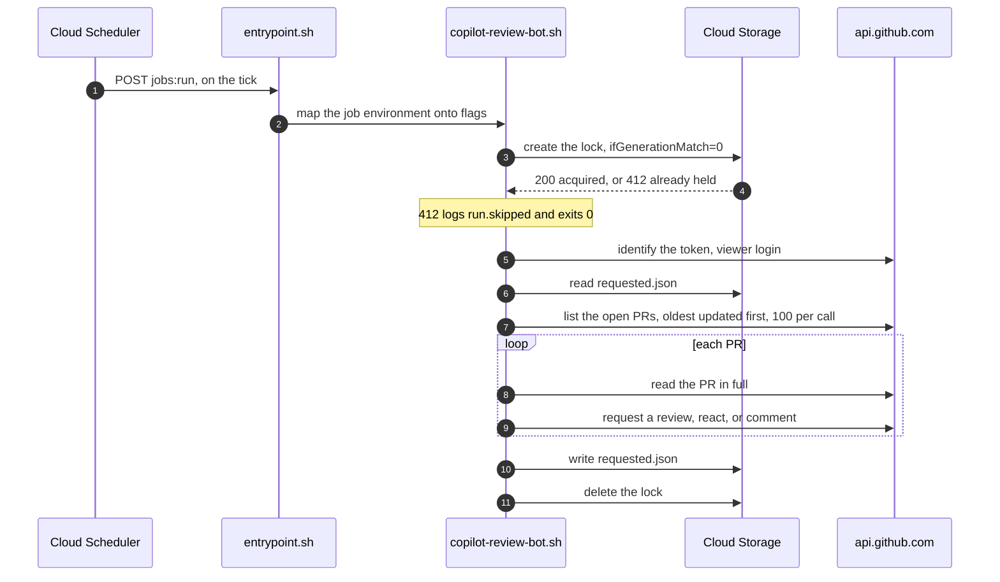
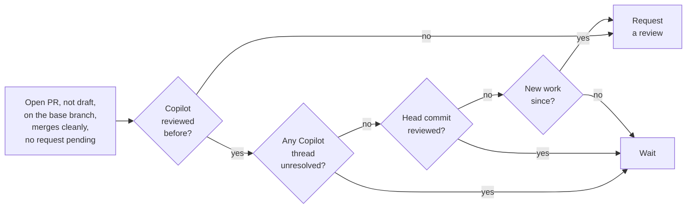
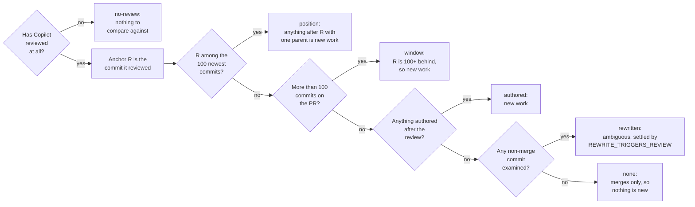
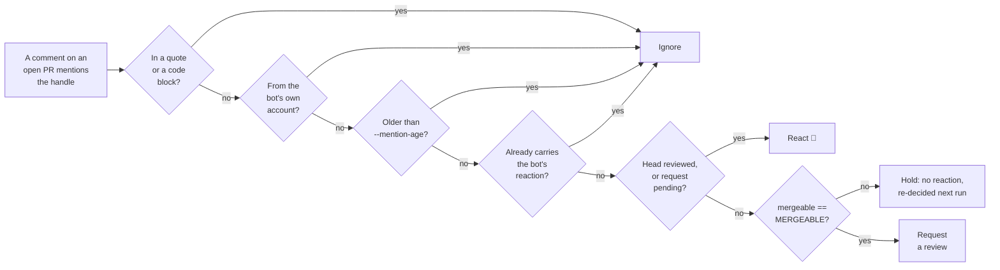
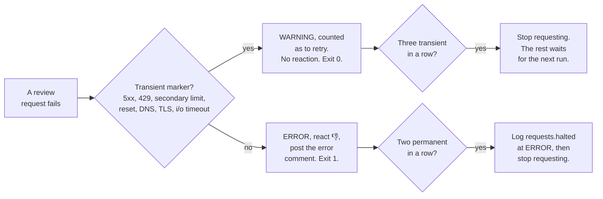
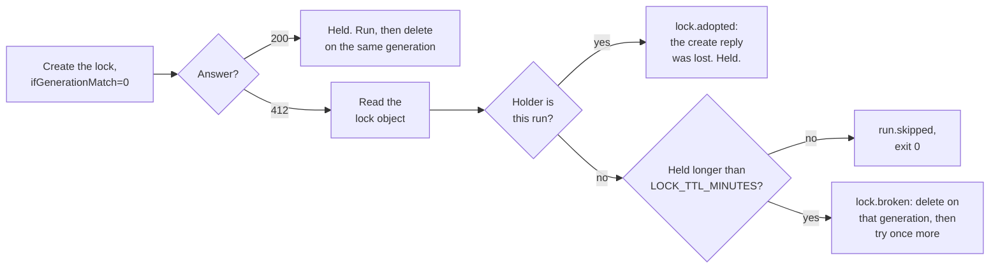

# copilot-review-bot

For the developer who has to maintain this bot, or explain a decision it made. It covers what the
bot does, when it acts, what it logs, and how to configure it.

How to test a change is in [tests/README.md](tests/README.md). How it runs in production is in
[deploy/README.md](deploy/README.md).

## What it does

The bot keeps GitHub Copilot reviews flowing on one repository. It requests a Copilot review when
one is due, and waits when one is not. One process watches one repository, so each watched
repository gets its own.

It is one bash script, driven by `gh` and `jq`, and it runs as a Cloud Run job about every 15
minutes. There is no webhook receiver and no inbound port. It keeps one small object in a Cloud
Storage bucket between runs. See [State and locking](#state-and-locking).

| Path                          | Purpose                                                                                                                                |
| ----------------------------- | -------------------------------------------------------------------------------------------------------------------------------------- |
| `copilot-review-bot.sh`       | The whole application.                                                                                                                 |
| [`deploy/`](deploy/README.md) | The image, the Cloud Run job, the tick, and the state bucket.                                                                          |
| [`tests/`](tests/README.md)   | The five suites and the harness they share.                                                                                            |
| `.dockerignore`               | Pares the image build context down to the two files the Dockerfile copies. It sits here because this directory *is* the build context. |

## Words used here

Each of these words means one thing, here and in [tests/README.md](tests/README.md) and
[deploy/README.md](deploy/README.md).

| Word               | Meaning                                                                   |
| ------------------ | ------------------------------------------------------------------------- |
| execution          | Cloud Run's own term for one container run of the job.                    |
| fleet              | Every job across every watched repository, taken together. Never one job. |
| PR                 | One GitHub pull request.                                                  |
| run                | One execution of the bot, start to exit.                                  |
| state root         | The directory or bucket URL under which the lock and the markers live.    |
| tick               | One firing of the Cloud Scheduler job that starts a run.                  |
| watched repository | The single repository one process monitors, named by `--repo`.            |

`<repo>` is the full `owner/name` slug, `<owner>` and `<name>` its two halves. Used the same way in
every document and script here, and matching GitHub's own GraphQL parameter names.

## Why the bot exists

GitHub's native trigger, "Automatically request Copilot code review" on a branch ruleset, needs
every contributor to hold an individual Copilot license, or the organization to enable Copilot
reviews for all members. Neither fits a project with decentralized, largely external contributors,
so the `@xrplf-bot` account holds the license instead and requests reviews on everyone's behalf.

The bot also chooses *when* to ask, which the native trigger cannot. It can:

* wait until every review thread Copilot opened is resolved,
* ignore a branch refresh, by requiring a non-merge commit,
* tell a restack from real work, using author dates rather than committer dates,
* backfill PRs that were already open when the policy was adopted,
* answer an `@xrplf-bot` mention on demand, including on drafts,
* bound the number of requests per run.

### Why polling

An inbound webhook needs an open port, which carries its own risk. The bot polls GitHub instead:
every run re-derives its decisions from scratch, using GitHub's current state rather than trusting
its own stored object. That is also what makes a run idempotent and crash-safe: delete the stored
object, or kill a run halfway, and the next run picks up correctly with at most one wasted API call.

### Why one process per repository

**One process watches exactly one repository.** In production that is one Cloud Run job per
repository, which isolates failures and stops a busy repository starving a quiet one under the
per-run cap. Two things follow from that:

* **They can all share one state root.** The bot namespaces its lock and markers under
  `<owner>/<name>`, so nothing per-process needs to be kept unique by hand.
* **The rate limit is per account, not per token or per process.** Every job draws on the same
  5,000-points-per-hour budget. The fleet-wide arithmetic is in [Rate limit
  budget](deploy/README.md#rate-limit-budget).

## What one run does



Each PR is decided as soon as it is fetched, so output starts with the first PR rather than after
the last fetch. A run that prints nothing for minutes is stuck, not working.

The lock, the markers, and the deadline all exist to make a run safe to interrupt. The exit trap
releases the lock first and saves the markers second, since an unreleased lock costs the next tick
while a lost marker costs one wasted API call.

## Requirements

Every item is checked before any work starts, and a missing one is reported with an installation
hint, so a missing dependency never turns a scheduled run into a silent no-op.

| Requirement             | Notes                                                                                                                                                                                         |
| ----------------------- | --------------------------------------------------------------------------------------------------------------------------------------------------------------------------------------------- |
| bash 4.4 or newer       | macOS ships 3.2 as `/bin/bash`; install a newer one with `brew install bash` and make sure it wins on `PATH`.                                                                                 |
| `gh`                    | Authenticated through `GH_TOKEN` or `GITHUB_TOKEN`.                                                                                                                                           |
| `jq`                    | -                                                                                                                                                                                             |
| `date`                  | GNU or BSD. The flavor is probed at startup.                                                                                                                                                  |
| `flock`                 | For a local state root only. From `util-linux` on Linux, `brew install flock` on macOS.                                                                                                       |
| `curl`                  | For a `gs://` state root only.                                                                                                                                                                |
| coreutils               | `mktemp`, `sed`, `grep`, `tr`, `head`, `tail`, `cat`, `cp`, `mv`, `rm`, `dirname`, `uname`. Checked at startup so a stripped-down container names the missing one instead of failing mid-run. |
| `timeout` or `gtimeout` | Also from coreutils. Optional: without it the run warns that `gh` calls are unbounded, and carries on.                                                                                        |

## When it requests a review

**Automatic requests** apply only to PRs that are open, not draft, that target the repository's base
branch, and that GitHub reports as merging cleanly into it. That base is the default branch, or
`--base BRANCH`. A PR that fails one of those, or that already has a review request pending, is left
alone.



Three of those gates need a definition:

* **Unresolved** counts only the threads Copilot opened. Human review threads are ignored. An
  outdated thread, whose code has since changed, still blocks unless `--ignore-outdated` is set.
* **New work** is at least one commit with exactly one parent since the commit Copilot reviewed. A
  merge commit has two parents, so pulling the base branch into the PR branch never triggers a
  review, while any real commit does.
* **Conflict** is GitHub's own `mergeable` field on the PR. A request needs the value `MERGEABLE`;
  both `CONFLICTING` and `UNKNOWN` stop it. See
  [Conflicts with the base branch](#conflicts-with-the-base-branch).

Deciding the second one is the subtle part.

### How "new work" is established

The commit Copilot reviewed is the anchor. Every decision records how the question was answered as a
`basis`, on `pr.evaluated` and on whichever outcome event follows it, so a wrong call can be audited
without re-deriving it.



`basis` takes six values. Four are the real comparison; `no-review` and `none` are the trivial ends,
both common enough in the log to be worth recognizing.

**Request?** reads as "does this basis, on its own, file a review request", assuming every earlier
gate already passed. Any one of those failing means no request whatever the basis says.

| Basis       | When                                                                                                             | Request?                                       | Why                                                                                                                                                                                                |
| ----------- | ---------------------------------------------------------------------------------------------------------------- | ---------------------------------------------- | -------------------------------------------------------------------------------------------------------------------------------------------------------------------------------------------------- |
| `no-review` | Copilot has never reviewed this PR, so there is no anchor                                                        | **Yes**                                        | Not a comparison at all; filed under `reason=never_reviewed`.                                                                                                                                      |
| `position`  | The reviewed commit is still among the commits examined                                                          | **Yes**, if any commit after it is not a merge | The exact case: yes on the first non-merge commit after the anchor, no when the only additions are merges.                                                                                         |
| `window`    | The PR has more commits than the 100 examined, so the reviewed one fell off the end                              | **Yes**                                        | New work by definition: the reviewed commit is at least 100 commits behind the head, so author dates get no say.                                                                                   |
| `authored`  | The reviewed commit is absent, because the branch was rewritten, and something was **authored** after the review | **Yes**                                        | Unambiguous new work.                                                                                                                                                                              |
| `rewritten` | The reviewed commit is absent and nothing was authored after the review                                          | **No** by default                              | Ambiguous: indistinguishable from a bare restack, or from a `git commit --amend` that added real work but kept the original author date. `REWRITE_TRIGGERS_REVIEW=true` turns this row into a yes. |
| `none`      | The reviewed commit is absent, nothing was authored after it, and every commit examined is a merge commit        | **No**                                         | Merges only, so nothing is new. Logs `pr.skipped` with `reason=no_new_commits`.                                                                                                                    |

`window` exists because the reviewed commit can be absent for two different reasons, and only one of
them is ambiguous: treating both as a rewrite would make a long-lived PR that repeatedly merges its
base branch skip forever, since its window would then hold only pre-review commits.

The author/committer distinction is the crux. A rebase stamps every commit it moves with a fresh
**committer** date and leaves the **author** date alone. Keying on committer dates would therefore
report the very commit Copilot already reviewed as brand new on every restack. Author dates make the
restack case answerable.

The residual ambiguity is `rewritten`: an amend that keeps the original author date but carries real
work is indistinguishable from a pure restack using metadata alone. The default waits rather than
re-reviewing on every rebase; anyone who disagrees can mention `@xrplf-bot` on the PR, or set
`REWRITE_TRIGGERS_REVIEW=true` to invert the default globally.

### Conflicts with the base branch

A review request needs GitHub to have positively established that the branch merges into its base.
Reviewing a diff that cannot merge is work nobody can act on, and the conflict has to be resolved
before the code is final anyway.

The test is GitHub's own `mergeable` field, reported on `pr.evaluated`. The rule is written as
**`MERGEABLE` or no request**, not as "not `CONFLICTING`", so a value GitHub adds later fails closed
rather than opening the gate:

| `mergeable`            | Means                                   | Request? | `pr.skipped` reason |
| ---------------------- | --------------------------------------- | -------- | ------------------- |
| `MERGEABLE`            | GitHub tried the merge and it applies   | yes      | -                   |
| `CONFLICTING`          | GitHub tried the merge and it conflicts | no       | `conflicting`       |
| `UNKNOWN`              | GitHub has produced no answer           | no       | `mergeable_unknown` |
| absent, or a new value | Same as no answer                       | no       | `mergeable_unknown` |

**Two reasons, not one, on purpose.** A skip caused by a missing answer must not be logged as a
conflict the PR does not have: a run full of `conflicting` describes the repository, while a run
full of `mergeable_unknown` describes GitHub failing to answer, which is the only warning that
reviews have stopped for a reason nobody can act on.

#### What `UNKNOWN` really is, and the risk it carries

GitHub computes mergeability in a background job, and querying the field is what schedules that job,
so a PR that changed recently answers `UNKNOWN` until the job has run. It usually clears within
minutes, but **it does not always clear**; updating the branch can get it unstuck.

The trade was made deliberately, in favor of never requesting a review of a diff whose mergeability
is unconfirmed. If reviews ever appear to have stopped, `reason=mergeable_unknown` is the first thing
to count in the log:

```bash
jq -r 'select(.event=="pr.skipped").reason' run.log | sort | uniq -c | sort -rn
```

#### Where the gate sits

**After** the checks for a pending request, an already-reviewed head commit, and a marker from this
run, and **before** the `basis` rules. So either reason means "this is what stopped a request", not
"and the PR also does not merge".

#### How much it changes in practice

It depends on the state of the repository. A conflicting PR is stopped here only if it survives every
earlier gate, so in steady state, where most PRs already carry a current review, mergeability is the
last thing standing between a candidate and a request and stops most of what reaches it. On a first
run against a repository where nothing has been reviewed, a much larger share of the backlog arrives
here instead.

## Asking Copilot, by name

GitHub's REST "request reviewers" endpoint rejects bot accounts. The GraphQL `requestReviews`
mutation takes them, but only as `botIds`, and this script deliberately knows no node ids. So it
sends `requestReviewsByLogin`, which takes logins:

```graphql
mutation($pullRequestId: ID!, $login: String!) {
  requestReviewsByLogin(input: {pullRequestId: $pullRequestId,
                                botLogins: [$login],
                                union: true}) {
    clientMutationId
  }
}
```

Three properties matter, and the first two are why this is by login and not by id:

* **A node id can change and a handle cannot.** GitHub owns the id; the login is the stable name.
  Every other Copilot test in this script matches on the login too, through `COPILOT_LOGINS`.
* **A stale id fails silently.** A wrong node id would succeed, file the request against an account
  that reviews nothing, and leave the PR looking reviewed-pending forever. A login that stops
  resolving is an error instead.
* **`union: true` adds to the reviewer set.** A PR's human reviewers are untouched, and somebody who
  has already reviewed is re-requested, which is the whole point here.

### Why not `gh pr edit --add-reviewer`

That is what this used to run, and it is where `@copilot` came from: gh's own alias, expanded to
`copilot-pull-request-reviewer` and passed to this same mutation. It was dropped because `gh pr edit`
sends **two** mutations concurrently: `requestReviewsByLogin` for the actual request, and
`updatePullRequest`, an unconditional no-op that GitHub refuses for any actor without push access.
The result was the worst kind of failure: the request landed, but the command still exited non-zero,
until the permanent breaker halted the run.

Sending the one mutation the bot actually wants keeps the account on **Triage**, the floor GitHub
asks for requesting a review, rather than needing Write on the watched repository. It also drops an
extra PR lookup gh needed only to build a replacing reviewer set that `union: true` makes
unnecessary. Upstream bug: [cli/cli#6274][ghbug].

[ghbug]: https://github.com/cli/cli/issues/6274

### How the reviewer is spelled

`requestReviewsByLogin` has three separate lists and the value alone says which one a reviewer
belongs in, so `--reviewer` is classified once at startup and sent verbatim:

| `--reviewer`                         | Field        | Rule                                                                           |
| ------------------------------------ | ------------ | ------------------------------------------------------------------------------ |
| `copilot-pull-request-reviewer[bot]` | `botLogins`  | A `[bot]` suffix. The default, and the mutation requires the suffix.           |
| `monalisa`                           | `userLogins` | Anything else.                                                                 |
| `myorg/team-name`                    | `teamSlugs`  | A `/`, which can only be a team. Sent as `owner/slug`, not split.              |
| `@copilot`                           | -            | **Refused**, exit 2, `reason=invalid_reviewer`. It is gh's alias, not a login. |

The `@` forms are refused rather than rewritten, so the setting, the `reviewer` field on `run.start`
and the string on the wire are always the same.

The suffix is the one place this differs from `COPILOT_LOGINS`, which holds `copilot-pull-request-reviewer`
with no suffix: that variable holds what GraphQL *reports* on a `Bot` node, while `--reviewer` holds
what the mutation *accepts*.

`requestReviewsByLogin` is **not available on GitHub Enterprise Server**. Nothing here targets GHES.

**No suite can check that `copilot-pull-request-reviewer[bot]` still resolves, or that GitHub still
re-requests an account that has already reviewed.** Every suite stubs the mutation. It is the one
assumption the whole tool rests on, and the only way to verify it is to watch a real request land.

## When somebody asks by name

A comment mentioning `@xrplf-bot`, configurable with `--mention-handle`, triggers a request on *any*
open PR, including drafts and PRs targeting other branches, which the automatic rules above both
exclude. Both PR conversation comments and inline review comments are scanned.

**Mergeability is the one automatic gate a mention does not override.** Draft status and the base
branch encode a policy that somebody asking by name has deliberately overridden; mergeability is not
a policy, and a review of a diff that cannot merge is no more useful for having been asked for.

**Open is the one condition a mention cannot override.** A closed or merged PR is never touched,
checked before the mention is even read. See [Known limitations](#known-limitations) for what that
means for somebody who asks on a merged PR.



The bot then reacts to the comment that asked:

| Reaction         | Meaning                                                                                                                          |
| ---------------- | -------------------------------------------------------------------------------------------------------------------------------- |
| 👍 `THUMBS_UP`   | Copilot review requested                                                                                                         |
| 👎 `THUMBS_DOWN` | The request failed permanently. The error code and message are also posted as a PR comment, because a reaction cannot carry one. |
| 👀 `EYES`        | Acknowledged, nothing to do: Copilot already reviewed the current head commit, or a request is already pending.                  |
| none             | The outcome is not settled yet. See [When a request fails](#when-a-request-fails), and the conflict case below.                  |

**The reaction doubles as the bookkeeping.** A comment already carrying one of those three reactions
*from the bot's own account* is skipped forever after, so no local state is needed to avoid answering
twice. A 👍 from a human does not count.

That is exactly why a mention on a PR that does not merge cleanly gets **no reaction at all**, logged
as `mention.deferred`. Left unreacted, it stays outstanding, and the run that first sees `mergeable:
MERGEABLE` files the review request on the strength of the original comment. Otherwise the mention
ages out of the `--mention-age` window on its own.

Mergeability is tested **after** "already reviewed" and "already pending", so an asker who already
has their review is answered with 👀 rather than held for a conflict they may never fix.

**A mention counts only where it could be a request.** Four kinds of text are stripped from a
comment body before the handle is looked for:

* **Block quotes**, so quoting somebody else's request does not re-fire it.
* **Fenced blocks**, opened with either three backticks or three tildes.
* **Indented code blocks**, meaning four or more leading spaces.
* **Inline code spans**, so a sentence explaining that you can ask the bot to re-review is
  documentation rather than a request.

The bot also ignores its own comments. Stripping is the safe direction, and it has one cost: see
[Known limitations](#known-limitations).

## When a request fails

A reaction is permanent, so the bot only uses one for an outcome that is permanent. Every failed
request is classified before the PR is touched.



| Class     | Examples                                                                          | Log                              | Mention                          | Exit |
| --------- | --------------------------------------------------------------------------------- | -------------------------------- | -------------------------------- | ---- |
| Transient | 5xx, 429, secondary rate limit, connection reset, DNS or TLS failure, i/o timeout | `WARNING`, counted as "to retry" | Left unreacted, retried next run | 0    |
| Permanent | 403 denied, 404, anything unrecognized                                            | `ERROR`                          | 👎 plus an error comment         | 1    |
| Deferred  | The per-run cap is reached                                                        | One `WARNING` for the run        | Left unreacted, retried next run | 0    |

Two details carry weight:

* **A secondary rate limit is a 403.** Classifying on the status code alone would call that
  permanent, thumb the comment down, and swallow somebody's request forever over a wait of a few
  minutes. Transient markers are therefore tested first.
* **Anything unrecognized is permanent.** Surfacing an unknown error once, loudly, beats retrying it
  silently every 15 minutes.

Set `TRANSIENT_FAILURES_ARE_ERRORS=true` if you would rather a transient failure also failed the run.

### Circuit breakers

Three breakers exist for one reason: a failure that is going to repeat should not be repeated once
per open PR.

| Breaker                         | Default | What it stops                                                                                                                                                                                                                  |
| ------------------------------- | ------- | ------------------------------------------------------------------------------------------------------------------------------------------------------------------------------------------------------------------------------ |
| `MAX_CONSECUTIVE_TRANSIENT`     | 3       | The run stops requesting and leaves the rest to the next one, rather than walking the remaining PRs one 502 at a time.                                                                                                         |
| `MAX_CONSECUTIVE_PERMANENT`     | 2       | The same, plus `requests.halted` at `ERROR`. A permanent failure on a review request is almost always a repository-wide fact: the account losing the Triage role, Copilot having no seat, or `--reviewer` no longer resolving. |
| `MAX_CONSECUTIVE_READ_FAILURES` | 3       | The sweep is abandoned, since each failed read has already cost several attempts and seconds of backoff.                                                                                                                       |

Every attempt counts against `--max-requests`, not just the successful ones, and
`SLEEP_BETWEEN_MUTATIONS` applies to every mutation on both outcomes, because GitHub's secondary
limits count what you send, not what worked.

`MAX_CONSECUTIVE_PERMANENT` guards reactions as well as requests: two permanent reaction failures in
a row stop the run writing any more of them, logging `mention.writes_halted` with
`reason=permanent_failures`.

### Exit status

| Code       | Meaning                                                                                                                                                                                                |
| ---------- | ------------------------------------------------------------------------------------------------------------------------------------------------------------------------------------------------------ |
| 0          | Nothing failed. **A run with nothing to do exits 0**, so a repository whose PRs are all up to date is a success, not a warning. A lock held by a live run is also 0, since being late is not an error. |
| 1          | Something the run should have done did not happen.                                                                                                                                                     |
| 2          | Fatal: the run could not start, or could not continue. See [the `run.fatal` reasons](#why-a-run-could-not-start-runfatal).                                                                             |
| 143 or 130 | Killed by `SIGTERM` or `SIGINT`.                                                                                                                                                                       |

Exiting 1 covers a permanent error on a PR, a repository that could not be listed at all, and a sweep
abandoned after repeated read failures. Every one of them logs an `ERROR` event, so the exit code
never disagrees with the log. A **transient** failure on one PR exits 0, since the next run retries
it. Set `TRANSIENT_FAILURES_ARE_ERRORS=true` if your alerting wants to know about those too.

An idle run is the normal steady state: `run.done` at `INFO` with `requests_filed: 0`. What deserves
an alert is the absence of `run.done` altogether. See [Monitoring and
alerting](deploy/README.md#monitoring-and-alerting).

## The per-run cap and the PR order

`--max-requests`, default 25, bounds how many review requests one run files. When the cap is reached
the run **stops**; the remaining PRs are not even fetched, since the only thing left to do with them
is defer them.

The PR list is ordered oldest-updated first, so the request budget goes to the real backlog before
anything else. Newest-first would spend the start of every run re-reading PRs it had already
serviced, since requesting a review is itself an update that bumps a PR back to the front. Oldest-
first avoids that, at the cost that a PR with a brand-new commit gets no special priority: it is
checked in whatever position its `updatedAt` puts it. Raise `--max-requests` if the resulting wait
for the tail of the backlog is longer than you want.

### A dry run measures the backlog, it does not preview the next run

`--dry-run` **ignores the cap**, deliberately: the cap exists to bound mutations, and a dry run makes
none. Stopping at the cap would destroy what a dry run is for, since a dry run that halted early could
only ever report "at least N".

So a dry run walks every open PR and counts everything that is due. `run.done` reports both numbers:

| Field                 | Means                                                                                     |
| --------------------- | ----------------------------------------------------------------------------------------- |
| `would_file`          | The whole outstanding backlog. How far behind the repository is.                          |
| `would_file_next_run` | What a real run would file before the cap stopped it. Never higher than `--max-requests`. |

Both are on every `run.done`, including a live run, where they are 0.

**A dry run costs a real run's worth of quota.** It reads every PR, so two or three dry runs while
debugging can push the fleet's hourly budget over, and the symptom lands on the *scheduled* runs
rather than on yours. Use `--pr N` when one PR is the question.

## State and locking

One thing has to survive between runs: `requested.json`, holding
`{"<owner>/<name>#<pr>": {"head": ..., "at": ...}}`, the head commit each request was filed for. It
guards against a double request in the window before GitHub reports the pending review request.
Entries older than `MARKER_MAX_AGE_DAYS`, default 90, are dropped on write.

One object rather than one file per PR is deliberate: a marker per PR would mean far more reads per
run on a large repository. One object means one read at startup and one write at the end.

Set `STATE_DIR` to either:

* a **local path**, which locks with `flock` on the lock file, or
* **`gs://bucket`, with an optional `/prefix`**, which needs no credentials of its own. On Cloud Run
  the script asks the instance metadata server for a short-lived token for the attached service
  account, so whatever IAM you granted that account is what applies. There is no key file and nothing
  to rotate. See [Identities and permissions](deploy/README.md#identities-and-permissions).

The prefix is optional; production leaves it out. A trailing slash is stripped either way, and a
multi-segment prefix works. Only `gs://` with no bucket is refused, with `reason=bad_state_dir`.

The bot appends the repository it is watching to the state directory, so both files live under
`${STATE_DIR}/<owner>/<name>/`. The production root is in [State lives in a
bucket](deploy/README.md#state-lives-in-a-bucket-not-in-tmp).

That is what lets every single-repository process share one root: the repository namespaces the
state, so there is no per-process prefix to choose and no way to collide. Two processes on the
*same* repository still contend for that one lock, which is the intended reading of it, since they
would be duplicating each other's work.

Deleting the state is safe. Worst case the bot re-files one request for a PR whose pending state has
not yet materialized, and an additive review request treats that as a no-op. Moving `STATE_DIR` has
the same effect: the new path is empty, so the first run there re-derives everything.

### The lock

A run that overlaps its predecessor would decide on stale state, and with shared state would also
drop the other run's markers when it writes.

`flock` is enough for a local state root, but is useless between two Cloud Run executions, which
share no kernel. So a `gs://` state root locks with an object instead: the run creates its `lock`
with an `ifGenerationMatch=0` precondition, which fails with 412 if anybody already holds it. The
lock is per repository, like the markers beside it.

A 412 has three possible meanings, and the run tells them apart by reading the object:



A second live run therefore logs `run.skipped` and exits 0, since being late is not an error. The
other two paths matter less often:

* **Adopted.** A creation whose response was lost, to a 503 or a dropped connection, retries into its
  own object and gets 412. Read as somebody else's lock, that would make the run skip itself and
  leave a lock nobody releases until the TTL.
* **Broken.** A lock older than `LOCK_TTL_MINUTES`, default 30, is treated as abandoned, so a killed
  execution cannot wedge the schedule forever. The break is itself conditional on the generation
  that was read, so two runs racing to break the same stale lock cannot both win.

Set `LOCK_TTL_MINUTES` just above whatever kills a run from the outside, such as a Cloud Run
`--task-timeout`. Below that, a slow but healthy run gets its lock stolen. Far above it, a killed run
blocks every tick until the window expires.

## What it logs

One line per event. In `json` mode, the default, that is one JSON object per line. Cloud Logging
recognizes `severity`, `message` and `time` and promotes them onto the log entry; everything else
lands in `jsonPayload`. `event`, `repo` and `pr` are also copied into
`logging.googleapis.com/labels`, so they can be filtered as labels:

```json
{"time":"2026-08-28T20:20:02.080Z","severity":"WARNING","event":"repo.stopped",
 "message":"stopping early: the run limit of 25 review requests is reached",
 "repo":"<owner>/<name>","reason":"run_limit","inspected":25,"total":263,
 "remaining":238,"limit":25,
 "logging.googleapis.com/labels":{"event":"repo.stopped","repo":"<owner>/<name>"}}
```

Numbers and booleans are emitted as JSON numbers and booleans, not strings, so Cloud Logging can
filter and build metrics on them arithmetically.

Nothing else writes to the stream. A raw `gh` error, a jq error and a shell redirect error are all
captured and re-emitted as events, so the one-object-per-line contract holds even on the failure
paths. Everything goes to stdout, deliberately, since severity rather than the choice of stream is
what marks a problem.

`--log-format text` renders the same events as logfmt, for reading in a terminal.

### The two terminal events

`run.done` and `run.aborted` are the only terminal events, so **the absence of either is the signal
to alert on**. `run.aborted` is emitted from the signal trap, with `reason=signal`, and from the
error trap, with `reason=unexpected_error`. Without it, an aborted run is indistinguishable from one
that never started, because the log simply stops.

Every event that reports stopping early carries a `reason` that names the real cause. The request
cap, the read-failure breaker (`read_failures`) and the run deadline (`run_deadline`) are
distinguishable rather than all reported as the cap. `run.done` repeats it as `stop_reason`.

### Why a run could not start: `run.fatal`

`run.fatal` is the only event on the exit-2 path, and `reason` says what to do about it: a bad
setting, an unusable machine, a bad credential, or a state root that could not be used. None of them
reached the point of deciding anything about a PR.

| Reason                  | What happened                                                                                                       | What to do                                                                                                       |
| ----------------------- | ------------------------------------------------------------------------------------------------------------------- | ---------------------------------------------------------------------------------------------------------------- |
| `bad_option`            | An unknown option, an option missing its value, or a setting that failed validation. Carries `setting` and `given`. | Fix whatever `setting` names, as a flag or as an environment variable.                                           |
| `bad_log_format`        | `--log-format` was neither `json` nor `text`.                                                                       | Use one of the two.                                                                                              |
| `invalid_reviewer`      | `--reviewer` or `REVIEWER` is empty, or starts with `@`.                                                            | Give it a login, or leave it unset for Copilot. See [How the reviewer is spelled](#how-the-reviewer-is-spelled). |
| `bad_repo`              | The repository is not `owner/repo`. Carries `given`.                                                                | Fix the spelling.                                                                                                |
| `no_repos`              | No repository was named.                                                                                            | Pass `--repo owner/repo`, or set `REPO`.                                                                         |
| `bad_state_dir`         | `STATE_DIR` starts with `gs://` and names no bucket.                                                                | Name the bucket.                                                                                                 |
| `bash_too_old`          | bash is older than 4.4.                                                                                             | Install a newer bash and make sure it wins on `PATH`.                                                            |
| `missing_prerequisites` | A required program is absent.                                                                                       | Install what it names.                                                                                           |
| `unusable_date`         | Neither `date -d` nor `date -v` works.                                                                              | Install GNU or BSD `date`.                                                                                       |
| `no_credentials`        | No `GH_TOKEN`, no `GITHUB_TOKEN`, and `gh` is not logged in.                                                        | In production this is the `gh-token` secret. See the [runbook](deploy/README.md#symptoms).                       |
| `viewer_unknown`        | GitHub did not name the account behind the token.                                                                   | A transient `failure_class` means try again. Otherwise replace the token.                                        |
| `state_bucket_unusable` | The lock could not be written, so the run cannot prove it is alone.                                                 | 403 is a missing `roles/storage.objectAdmin`. 404 is a bucket that does not exist.                               |
| `state_dir_unwritable`  | The local state directory could not be created.                                                                     | Check the path and its permissions.                                                                              |
| `lock_unwritable`       | The local lock file could not be created.                                                                           | Check that the state directory exists and is writable.                                                           |
| `flock_unusable`        | `flock` could not be executed, so the run refused to proceed unlocked.                                              | Reinstall `util-linux`, or `flock` on macOS.                                                                     |
| `internal`              | A bug.                                                                                                              | Nothing an operator can fix. Report it.                                                                          |

One other event ends a run at exit 2 with no `run.fatal` beside it: `gcs.no_token`, when no Google
access token could be obtained from the metadata server.

### Event reference

`DEBUG` events appear only under `-v`. Several events carry two severities, and the rule is the same
in every case: the higher one fires when the run needs somebody to look.

Events are grouped by prefix, in the order a run reaches them: the run itself, then the repository,
then one PR, then what it decided, then the lock and the state it leaves behind.

| Event                         | Severity                                                       | Meaning                                                                                                                                                                                           |
| ----------------------------- | -------------------------------------------------------------- | ------------------------------------------------------------------------------------------------------------------------------------------------------------------------------------------------- |
| `run.start`                   | INFO                                                           | The run began. Carries the version, the viewer login, the reviewer actually sent, and every headline setting.                                                                                     |
| `run.done`                    | INFO, else ERROR when the run exits non-zero                   | The run finished. Carries `requests_filed`, and on a dry run `would_file` and `would_file_next_run`.                                                                                              |
| `run.aborted`                 | ERROR                                                          | A signal or an unexpected error ended the run early.                                                                                                                                              |
| `run.skipped`                 | INFO                                                           | Another run holds the lock. Exit 0.                                                                                                                                                               |
| `run.fatal`                   | ERROR                                                          | The run could not start or could not continue. See [the reasons above](#why-a-run-could-not-start-runfatal).                                                                                      |
| `run.prerequisite_missing`    | ERROR                                                          | A required program is absent. Carries an installation hint.                                                                                                                                       |
| `run.no_gh_timeout`           | WARNING                                                        | Neither `timeout` nor `gtimeout` is on `PATH`, so `gh` calls are unbounded.                                                                                                                       |
| `repo.start`                  | INFO                                                           | The sweep began. Carries the base branch and `open_prs`, the true open PR count.                                                                                                                  |
| `repo.more_prs_than_expected` | WARNING                                                        | The repository has more open PRs than `EXPECTED_OPEN_PRS`. Only under-declaring warns.                                                                                                            |
| `repo.progress`               | INFO                                                           | Heartbeat, every `PROGRESS_EVERY` PRs on a non-verbose run.                                                                                                                                       |
| `repo.done`                   | INFO                                                           | The sweep finished.                                                                                                                                                                               |
| `repo.stopped`                | WARNING                                                        | The sweep stopped early. Carries the `reason`.                                                                                                                                                    |
| `repo.list_failed`            | ERROR                                                          | The PR list could not be read, paged, or parsed.                                                                                                                                                  |
| `repo.read_failed`            | ERROR                                                          | The repository itself could not be read.                                                                                                                                                          |
| `repo.no_base_branch`         | ERROR                                                          | The base branch could not be determined.                                                                                                                                                          |
| `repo.no_matching_base`       | WARNING                                                        | Every open PR targets a different branch, so nothing can ever be requested. Check `--base`.                                                                                                       |
| `pr.fetching`                 | DEBUG                                                          | About to read one PR.                                                                                                                                                                             |
| `pr.evaluated`                | DEBUG                                                          | The full decision record for one PR.                                                                                                                                                              |
| `pr.evaluate_failed`          | ERROR                                                          | The PR payload could not be evaluated.                                                                                                                                                            |
| `pr.skipped`                  | DEBUG, else INFO for `reason=not_open`                         | The PR needs nothing, with the reason. Routine skips are DEBUG. `not_open` is only reachable through `--pr`, where somebody asked about that one PR by hand and must see the answer without `-v`. |
| `pr.read_failed`              | WARNING for a transient failure, ERROR for a permanent one     | One PR could not be read. Classified exactly like a failed request.                                                                                                                               |
| `pr.read_unexpected`          | ERROR                                                          | The response carried no `pullRequest` object: the PR is gone, or the repository was renamed mid-run.                                                                                              |
| `pr.mentions_failed`          | ERROR                                                          | The PR could not be scanned for mentions.                                                                                                                                                         |
| `pr.base_gate_bypassed`       | INFO                                                           | `--pr` named a PR that targets another branch, so the base gate was skipped.                                                                                                                      |
| `review.requested`            | INFO                                                           | A review request was filed.                                                                                                                                                                       |
| `review.deferred`             | WARNING the first time in a run, DEBUG after that              | The request was left for the next run. The run announces hitting its budget once, then stops repeating it.                                                                                        |
| `review.request_failed`       | WARNING for a transient failure, ERROR for a permanent one     | See [When a request fails](#when-a-request-fails).                                                                                                                                                |
| `requests.halted`             | WARNING for the transient breaker, ERROR for the permanent one | A breaker stopped further requests. Carries `reviewer` and `reviewer_field`.                                                                                                                      |
| `reads.halted`                | ERROR                                                          | The read-failure breaker abandoned the sweep.                                                                                                                                                     |
| `mention.answering`           | DEBUG                                                          | A mention is being answered.                                                                                                                                                                      |
| `mention.no_action`           | DEBUG                                                          | A mention needs no action, with the reason.                                                                                                                                                       |
| `mention.deferred`            | DEBUG                                                          | A mention is left outstanding, unreacted, so a later run can answer it. `conflicting`, or `mergeable_unknown` when GitHub has produced no answer.                                                 |
| `mention.writes_halted`       | WARNING                                                        | No further reactions or error comments will be written this run. `reason` says which limit stopped it: `write_cap` for `MAX_MENTION_WRITES_PER_RUN`, or `permanent_failures`.                     |
| `reaction.added`              | INFO                                                           | A reaction was added. Carries the comment id.                                                                                                                                                     |
| `reaction.exists`             | DEBUG                                                          | The reaction was already present.                                                                                                                                                                 |
| `reaction.failed`             | WARNING for a transient failure, ERROR for a permanent one     | The reaction could not be added. A missing `Issues: Read and write` lands here.                                                                                                                   |
| `comment.posted`              | INFO                                                           | An error comment was posted.                                                                                                                                                                      |
| `comment.failed`              | WARNING                                                        | The error comment could not be posted.                                                                                                                                                            |
| `lock.acquired`               | DEBUG                                                          | The lock is held by this run.                                                                                                                                                                     |
| `lock.skipped`                | DEBUG                                                          | A dry run makes no writes, so it takes no lock.                                                                                                                                                   |
| `lock.broken`                 | WARNING                                                        | A lock older than its TTL was treated as abandoned and removed.                                                                                                                                   |
| `lock.adopted`                | WARNING                                                        | This run had already created the lock, so its create response was lost. Adopted rather than skipped.                                                                                              |
| `lock.release_failed`         | WARNING                                                        | The lock could not be released. It expires after its TTL.                                                                                                                                         |
| `lock.release_unconditional`  | WARNING                                                        | The generation was never learned, so the lock was released without a precondition rather than left behind.                                                                                        |
| `state.loaded`                | DEBUG                                                          | The markers were read.                                                                                                                                                                            |
| `state.saved`                 | DEBUG                                                          | The markers were written.                                                                                                                                                                         |
| `state.ephemeral`             | WARNING                                                        | The state root is local on a platform with a fresh filesystem per execution, so markers are lost.                                                                                                 |
| `state.read_failed`           | WARNING                                                        | The marker object could not be read.                                                                                                                                                              |
| `state.unreadable`            | WARNING                                                        | The stored markers are not a JSON object and are being ignored. At worst one extra request per PR.                                                                                                |
| `state.write_failed`          | ERROR                                                          | The markers could not be written.                                                                                                                                                                 |
| `state.write_skipped`         | WARNING                                                        | The stored markers could not be read this run, so they are left alone rather than replaced.                                                                                                       |
| `state.write_conflict`        | WARNING                                                        | Another run published markers first, so the two sets are merged and the write retried.                                                                                                            |
| `gcs.retry`                   | DEBUG                                                          | A Cloud Storage call is being retried.                                                                                                                                                            |
| `gcs.no_token`                | ERROR                                                          | No Google access token could be obtained from the metadata server.                                                                                                                                |
| `gh.error`                    | DEBUG                                                          | The raw `gh` error for a failed call.                                                                                                                                                             |

When a repository read fails, the `access.*` family carries the diagnosis and a `remedy` code, so a
token rotation gone wrong is diagnosed by filtering on them.

| Event                     | Diagnosis                                                                                                                                                              |
| ------------------------- | ---------------------------------------------------------------------------------------------------------------------------------------------------------------------- |
| `access.token_rejected`   | The token itself is not valid.                                                                                                                                         |
| `access.sso_required`     | The token needs SAML SSO authorization for the organization.                                                                                                           |
| `access.denied`           | The token is valid but not permitted on this repository.                                                                                                               |
| `access.fine_grained_pat` | A fine-grained PAT that was never granted this repository, which is deny-by-default even for public ones.                                                              |
| `access.anonymous_probe`  | What an anonymous client sees for the same repository, which separates a token problem from a repository problem. ERROR, except an inconclusive probe, which is DEBUG. |

`remedy` is not confined to that family. Seven events carry one, and it always names the fix rather
than the fault, so a filter on `remedy` finds every event somebody can act on:

| Event                                       | `remedy`                       |
| ------------------------------------------- | ------------------------------ |
| `access.token_rejected`                     | `replace_token`                |
| `access.sso_required`                       | `authorize_sso`                |
| `access.fine_grained_pat`                   | `grant_repo_or_public_read`    |
| `run.fatal`, `reason=state_bucket_unusable` | `grant_storage_objectAdmin`    |
| `run.no_gh_timeout`                         | `install_coreutils`            |
| `requests.halted`, the permanent breaker    | `check_role_seat_and_reviewer` |
| `state.ephemeral`                           | `use_gcs_state_dir`            |

## Options

Given twice, the last wins. There are no positional arguments.

**A flag and its environment variable are not always spelled the same.** Most pairs match exactly.
The exceptions leave out what the argument placeholder already says, or what one invocation makes
obvious anyway:

| Flag                 | Variable               | What the flag leaves out                                         |
| -------------------- | ---------------------- | ---------------------------------------------------------------- |
| `--state DIR`        | `STATE_DIR`            | `DIR`, which the placeholder states                              |
| `--mention-age DAYS` | `MENTION_MAX_AGE_DAYS` | `MAX` and `DAYS`                                                 |
| `--max-requests N`   | `MAX_REQUESTS_PER_RUN` | `PER_RUN`: a command you typed is one run, so it needs no saying |

The variable keeps the longer name because a variable set on a Cloud Run job outlives every run it
configures, so `PER_RUN` is what distinguishes a per-run cap from a total. `deploy/jobs.json` follows
the variable rather than the flag; [its field names are the variables
lowercased](deploy/README.md#add-or-change-a-watched-repository).

| Option                  | Env                    | Default                                                            | Notes                                                                                                                                                                                                                                                                                           |
| ----------------------- | ---------------------- | ------------------------------------------------------------------ | ----------------------------------------------------------------------------------------------------------------------------------------------------------------------------------------------------------------------------------------------------------------------------------------------- |
| `-r, --repo owner/name` | `REPO`                 | required                                                           | The one repository this process watches. `REPO` is used only when no `--repo` is given.                                                                                                                                                                                                         |
| `--base BRANCH`         | -                      | the repository's default branch                                    | Gate for automatic requests.                                                                                                                                                                                                                                                                    |
| `--state DIR`           | `STATE_DIR`            | `${XDG_STATE_HOME:-${HOME:-/tmp}/.local/state}/copilot-review-bot` | Local path, or `gs://bucket` with an **optional** `/prefix`.                                                                                                                                                                                                                                    |
| `--reviewer NAME`       | `REVIEWER`             | `copilot-pull-request-reviewer[bot]`                               | Who the review is requested from, as a GitHub login. A bot keeps its `[bot]` suffix, a person is bare (`monalisa`) and a team is `owner/slug` (`myorg/team-name`). **Refuses a leading `@`**, including gh's `@copilot` alias. See [How the reviewer is spelled](#how-the-reviewer-is-spelled). |
| `--mention-handle NAME` | `MENTION_HANDLE`       | `xrplf-bot`                                                        | The login the bot answers to in comment bodies. **Refuses a leading `@`**, and must be letters, digits and hyphens.                                                                                                                                                                             |
| `--mention-age DAYS`    | `MENTION_MAX_AGE_DAYS` | `7`                                                                | Ignore older comments. Keeps the first run from replying to years of history.                                                                                                                                                                                                                   |
| `--max-requests N`      | `MAX_REQUESTS_PER_RUN` | `25`                                                               | The run stops when it is reached. See [The per-run cap](#the-per-run-cap-and-the-pr-order).                                                                                                                                                                                                     |
| `--ignore-outdated`     | `IGNORE_OUTDATED`      | `false`                                                            | Treat outdated Copilot threads as resolved.                                                                                                                                                                                                                                                     |
| `--log-format FMT`      | `LOG_FORMAT`           | `json`                                                             | `json` or `text`.                                                                                                                                                                                                                                                                               |
| `--pr N`                | -                      | -                                                                  | Debug a single PR.                                                                                                                                                                                                                                                                              |
| `-n, --dry-run`         | -                      | -                                                                  | Decide and log, change nothing **on GitHub**, and take no lock, local or `gs://`. See [A dry run measures the backlog](#a-dry-run-measures-the-backlog-it-does-not-preview-the-next-run).                                                                                                       |
| `-v, --verbose`         | -                      | -                                                                  | Emit `DEBUG` events too: every PR including skips, with the reason.                                                                                                                                                                                                                             |
| `--explain FILE`        | -                      | -                                                                  | Run the decision rules over a saved `pullRequest` object and print the result. See [tests/README.md](tests/README.md#debug-one-pr-with---explain).                                                                                                                                              |
| `--version`             | -                      | -                                                                  | Print the version, also a `version` field on `run.start`, and exit 0.                                                                                                                                                                                                                           |
| `-h, --help`            | -                      | -                                                                  | Print the usage block and exit 0.                                                                                                                                                                                                                                                               |

### Caps, breakers and pacing

| Variable                        | Default | Meaning                                                                                                                                                                                              |
| ------------------------------- | ------- | ---------------------------------------------------------------------------------------------------------------------------------------------------------------------------------------------------- |
| `MAX_MENTION_WRITES_PER_RUN`    | `50`    | Reactions and error comments the run may write in total, since `--max-requests` bounds review requests only. The remainder is left unreacted, which is the state the next run treats as outstanding. |
| `MAX_CONSECUTIVE_TRANSIENT`     | `3`     | Transient request failures in a row before the run stops requesting.                                                                                                                                 |
| `MAX_CONSECUTIVE_PERMANENT`     | `2`     | Permanent request failures in a row before the run stops requesting. Also bounds permanent **reaction** failures the same way, separately. See [Circuit breakers](#circuit-breakers).                |
| `MAX_CONSECUTIVE_READ_FAILURES` | `3`     | Failed PR reads in a row before the sweep is abandoned.                                                                                                                                              |
| `RUN_DEADLINE_SECONDS`          | `900`   | Wall-clock budget, checked between PRs. `0` disables. Keep it below the platform's task timeout.                                                                                                     |
| `SLEEP_BETWEEN_MUTATIONS`       | `1`     | Seconds between mutations, on both outcomes. Eases GitHub's secondary rate limits.                                                                                                                   |
| `PROGRESS_EVERY`                | `25`    | Heartbeat interval in PRs for non-verbose runs. `0` disables. Verbose runs log every PR instead.                                                                                                     |

### Timeouts and retries

| Variable                                      | Default     | Meaning                                                                                                                        |
| --------------------------------------------- | ----------- | ------------------------------------------------------------------------------------------------------------------------------ |
| `GH_TIMEOUT`                                  | `60`        | Seconds per `gh` call, applied with `timeout(1)`, since `gh` has no timeout of its own. `0` disables.                          |
| `GH_MAX_ATTEMPTS` / `GH_RETRY_BASE_SECONDS`   | `3` / `3`   | Attempts per read, and the linear backoff base. Bounds `MAX_CONSECUTIVE_READ_FAILURES`.                                        |
| `GCS_HTTP_TIMEOUT` / `GCS_TOKEN_TIMEOUT`      | `60` / `10` | Seconds per Cloud Storage call and per metadata-server call.                                                                   |
| `GCS_MAX_ATTEMPTS` / `GCS_RETRY_BASE_SECONDS` | `3` / `2`   | Attempts per Cloud Storage call, retried on `000`, 429 and 5xx, and the linear backoff base for them. `0` retries immediately. |
| `CLEANUP_HTTP_TIMEOUT`                        | `3`         | Seconds per call once the exit trap is running, which has only the platform's shutdown grace period to work in.                |

### State and credentials

| Variable                    | Default                            | Meaning                                                                                                                                |
| --------------------------- | ---------------------------------- | -------------------------------------------------------------------------------------------------------------------------------------- |
| `LOCK_FILE`                 | `${STATE_DIR}/<owner>/<name>/lock` | Local state only. An explicit value is used as given, without the per-repository nesting.                                              |
| `LOCK_TTL_MINUTES`          | `30`                               | `gs://` state only. When an unreleased lock is treated as abandoned. Set it just above your task timeout.                              |
| `MARKER_MAX_AGE_DAYS`       | `90`                               | How long a head-commit marker is kept.                                                                                                 |
| `GOOGLE_OAUTH_ACCESS_TOKEN` | -                                  | A Google access token, for driving a `gs://` state root from outside Cloud Run. There is no fallback to your `gcloud` login.           |
| `GOOGLE_SERVICE_ACCOUNT`    | the metadata server                | The account name used in a Cloud Storage permission error. Only worth setting off Cloud Run, where there is no metadata server to ask. |

### Behavior

| Variable                        | Default                         | Meaning                                                                                                                                                                                                                                                                                           |
| ------------------------------- | ------------------------------- | ------------------------------------------------------------------------------------------------------------------------------------------------------------------------------------------------------------------------------------------------------------------------------------------------- |
| `REWRITE_TRIGGERS_REVIEW`       | `false`                         | Whether a force-push with nothing newly authored counts as new work.                                                                                                                                                                                                                              |
| `TRANSIENT_FAILURES_ARE_ERRORS` | `false`                         | Whether a transient failure also makes the run exit 1.                                                                                                                                                                                                                                            |
| `EXPECTED_OPEN_PRS`             | -                               | How many open PRs this repository is expected to have. **Enforces nothing**: the run reads however many there are. A run that finds more logs `repo.more_prs_than_expected`, since that figure is what [the fleet's quota is budgeted at](deploy/README.md#rate-limit-budget). Empty disables it. |
| `COPILOT_LOGINS`                | `copilot-pull-request-reviewer` | Logins treated as Copilot for **detection**, comma separated, matched case-insensitively and only on a `Bot` account. Requesting a review is the other direction, and uses `--reviewer`.                                                                                                          |

Three more variables exist only so a test can substitute a stub. They are listed in
[tests/README.md](tests/README.md#how-the-stubs-work).

## Cost and duration per run

One repository with `N` open PRs costs roughly `1 + ceil(N/100) + N` GraphQL calls: one to identify
the token, one per page of the PR list, and one per PR. Add two per review request, and a handful of
small Cloud Storage calls per run for the lock and state.

**Calls are not points**, and the cost is not derivable from the node count either. The measured
per-call costs and the fleet-wide ceiling live with the code that consumes them, in [Rate limit
budget](deploy/README.md#rate-limit-budget). `deploy/rate-budget.sh` does that arithmetic across
every deployed job and fails the build before the quota is exceeded.

Mutations are spaced by `SLEEP_BETWEEN_MUTATIONS` and capped by `--max-requests`, since GitHub's
*secondary* limits care about burst mutation rate, not points.

Calls are sequential, so wall-clock time is roughly one second per open PR. That fits comfortably
inside a 15-minute schedule for a repository of a few hundred open PRs. If a run does overrun the
next tick, the lock makes the later run exit rather than double up. `RUN_DEADLINE_SECONDS` stops a
run that is going badly before the platform kills it, which matters because being killed also loses
the lock for the rest of its TTL.

Every PR is fetched every run, deliberately. Filtering on `updatedAt` would be the obvious economy,
but resolving a review thread does not bump it, and "Copilot's threads are now all resolved" is
exactly one of the transitions that has to be noticed. Verified against a real PR: resolving a thread
through the GitHub UI left `updatedAt` and `headRefOid` both unchanged, so that transition is
invisible to any `updated:>=` filter, whether asked through GraphQL `search` or REST
`/issues?since=`.

That rules out the two economies worth wanting:

* **An incremental cursor**, keyed on the newest `updatedAt` seen, would advance past a PR whose
  threads were resolved afterwards and never come back to it, with nothing logging the omission.
* **A per-run cap on PR reads**, to bound cost from configuration alone, would mean the same PRs get
  read every run, since a read does not mutate a PR and so never rotates the oldest-updated-first
  ordering. The request cap escapes this only because filing a request *is* an update.

Re-test before building on either. If GitHub ever starts stamping thread resolution, both become
available and a large share of the fleet's spend goes away.

## Known limitations

* **Dismissed reviews still count.** A Copilot review a maintainer has dismissed is still "Copilot
  has reviewed", so if it reviewed the head commit the bot will not re-request. Dismissing and
  expecting a fresh review does not work. Use an `@xrplf-bot` mention.
* **Amended commits.** See [How "new work" is established](#how-new-work-is-established). An amend
  that carries real work looks exactly like a restack, because both preserve the author date. With
  the default `REWRITE_TRIGGERS_REVIEW=false`, such a change waits for either a further commit or an
  `@xrplf-bot` mention.
* **Cherry-picks after a force-push.** A commit written before the review but cherry-picked onto a
  rewritten branch has an author date that predates the review, so it is not counted. Only the
  rewritten-branch path is affected.
* **Commit window.** Only the most recent 100 commits of a PR are examined. When the reviewed commit
  falls outside that window the bot knows it did, because it compares against the PR's total commit
  count, and counts it as new work under `basis=window` rather than guessing from dates.
* **Review thread window.** The most recent 100 review threads are examined, and the most recent 20
  comments within each. A PR with more than 100 threads whose Copilot threads are all among the
  *oldest* would look as though Copilot has no open threads, and could get a re-review it has not
  earned. Every connection takes the newest slice for this reason.
* **Outdated threads.** A Copilot thread whose code has since changed stays unresolved and keeps
  blocking, which matches the letter of the rule. If your reviewers routinely leave those to rot,
  `--ignore-outdated` unblocks them.
* **Mention window.** Comments older than `--mention-age` days are never answered, so a mention that
  arrives while the bot is down for over a week is missed. Reactions, not timestamps, prevent
  duplicates. The window exists only to bound the first run.
* **A mention inside a code block is not seen.** Block quotes, fenced blocks, indented code blocks
  and inline code spans are all stripped before the handle is looked for. An indented block is four
  or more leading spaces, and a wrapped list item can reach that, so an occasional real mention is
  dropped. Nothing is logged, because the handle was never found. Not answering is the safe
  direction: ask again on an unindented line of its own.
* **A mention on a closed or merged PR gets no answer at all.** Not even a 👎. The sweep lists
  `states: OPEN`, so the comment is never read, and `--pr` on a non-open PR stops at `pr.skipped`
  with `reason=not_open` before the mention handling. Listing closed PRs too would be far more
  expensive on a repository with a large closed-PR history, and Copilot cannot review a closed PR
  anyway. Whoever asked can see the PR is merged: reopen the PR, or ask on a new one.
* **PR list pagination.** The PR list is sorted by `updatedAt`, which can change while a repository
  with more than 100 open PRs is being paged through, since each page is a separate GraphQL call. A
  PR updated at the wrong moment can shift past a page boundary and be missed for that run. Every run
  re-lists from scratch, so this self-heals on the next one. It only delays a decision, never
  permanently drops one.
* **Copilot cannot review its own trigger.** If Copilot is rate-limited or unlicensed, requests
  succeed and nothing happens. The bot has no way to distinguish that from a slow review, and will
  not re-request while the request stays pending.

## Related documents

* [tests/README.md](tests/README.md) - the five suites, `--explain`, and running the bot by hand.
* [deploy/README.md](deploy/README.md) - the image, the Cloud Run job, permissions, and the runbook.
* [../README.md](../README.md) - the repository, and the CI that ships this.
