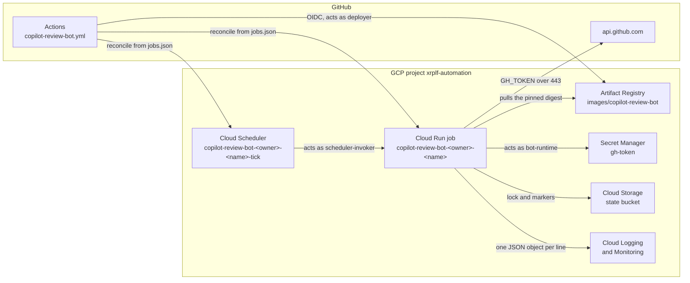
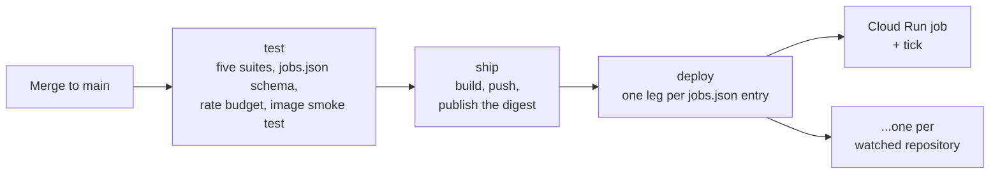
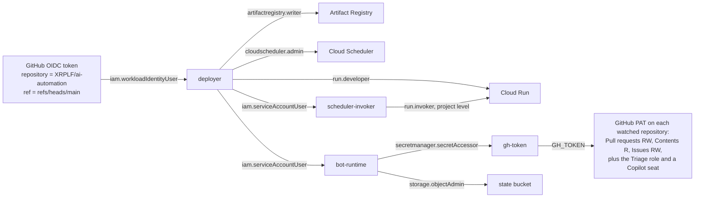
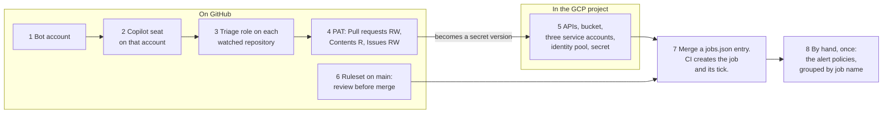

# Deployment: GCP `xrplf-automation`

For the system administrator who has to grant access, and for whoever is on call when the bot stops
working. It covers what runs in production, who may change it, how to add a watched repository, and
what to do when a tick fails.

What the bot decides, and why, is in [../README.md](../README.md). How to test a change is in
[../tests/README.md](../tests/README.md). `run`, `tick`, `execution`, `fleet` and `state root` each
mean one thing throughout: see [Words used here](../README.md#words-used-here). In the commands
below, `<job>` is a `name` from [`jobs.json`](jobs.json) and `<owner>/<name>` is the repository that
job watches. Substitute both. Nothing here names a particular one, because `jobs.json` is the only
list of them.

**Setting this up for the first time?** Start at [Set it up from scratch](#set-it-up-from-scratch),
which puts the eight steps in order and links to the section that explains each one.

## What runs in production

copilot-review-bot runs as **one Cloud Run job per watched repository** in the `xrplf-automation`
project. Each job has its own Cloud Scheduler job, called its tick. There is no VM, no inbound
endpoint, and nothing running between ticks.

Egress is `api.github.com` and `storage.googleapis.com` over 443. There is no ingress.



Everything in this directory belongs to that one tool, which is why it sits inside
[`copilot-review-bot/`](../README.md) rather than at the repository root.

## The pieces

| Piece             | Name                                                                       | Purpose                                                                                                                                                                                                                                               |
|-------------------|----------------------------------------------------------------------------|-------------------------------------------------------------------------------------------------------------------------------------------------------------------------------------------------------------------------------------------------------|
| Job list          | [`jobs.json`](jobs.json)                                                   | Which repositories are watched, on what schedule. The source of truth: CI brings every listed job into line with it on every push. A job *removed* from the list is not deleted. See [Removing an entry](#removing-an-entry-does-not-remove-the-job). |
| Cloud Run job     | `copilot-review-bot-<owner>-<name>`                                        | One bot run per execution, in `us-central1`. One task, no retries. See [Configuration](#configuration).                                                                                                                                               |
| Cloud Scheduler   | `copilot-review-bot-<owner>-<name>-tick`                                   | Executes its job on the schedule in `jobs.json`.                                                                                                                                                                                                      |
| Secret Manager    | `gh-token`                                                                 | The bot account's GitHub PAT, injected as `GH_TOKEN`.                                                                                                                                                                                                 |
| Cloud Storage     | `xrplf-copilot-review-bot-state`                                           | The lock and the head-commit markers, under `<owner>/<name>/`.                                                                                                                                                                                        |
| Artifact Registry | `images/copilot-review-bot`                                                | Runtime image: Debian, bash 5, `gh`, `jq`, `curl`, **and the bot itself**.                                                                                                                                                                            |
| GitHub Actions    | [`copilot-review-bot.yml`](../../.github/workflows/copilot-review-bot.yml) | Tests every change to `copilot-review-bot/`. On a push to `main` it builds the image and reconciles every job, through Workload Identity Federation.                                                                                                  |

### Files in this directory

| File             | Purpose                                                                                                                                     |
|------------------|---------------------------------------------------------------------------------------------------------------------------------------------|
| `Dockerfile`     | The runtime image, with the bot baked in. Built from the tool directory, not from this one, because both `COPY` paths are relative to that. |
| `entrypoint.sh`  | Maps the job's environment onto the bot's flags, and passes `--args` through.                                                               |
| `jobs.json`      | Which repositories are watched, on what schedule. The source of truth.                                                                      |
| `deploy-job.sh`  | Reconciles one Cloud Run job and its tick with `jobs.json`. Idempotent.                                                                     |
| `rate-budget.sh` | Validates `jobs.json` and refuses a fleet that cannot fit the API quota.                                                                    |
| `job-config.sh`  | Derives the job name and the tick cron from an entry. Sourced by the two scripts above, so they cannot disagree.                            |

## How a change reaches production

A merge to `main` is the whole deployment path. The `test` job runs on every event, and `ship` and
`deploy` run only on a push to `main`, only after `test` passes.



**The image is the whole deployment.** The bot is baked into it, so what CI built is what runs.
Nothing is fetched at run time, which means three things:

* The runtime needs no read access to this repository, so the token only needs the watched
  repositories. See [Identities and permissions](#identities-and-permissions).
* The job cannot execute code that did not go through CI.
* An execution starts with no network round trip of its own.

`docker build` is uncached, and the jobs are pinned to the image **digest**, never to a tag, so the
deployed image cannot change under them. CI asserts the match: the `test` job compares `sha256sum`
of `/app/copilot-review-bot.sh` inside the image against the working tree, and refuses to ship if
they differ.

That guarantee is about the **bot**, not the whole image. Nothing in the Dockerfile is
version-pinned, so two builds of one commit can carry different tool versions. The `sha256sum` gate
is what makes the bot itself traceable to a commit. `ship` also pushes `:<commit-sha>` and
`:latest`. Nothing in production reads either, and `:latest` exists only for the one-time bootstrap
build in [First-time provisioning](#first-time-provisioning-the-gcp-commands).

## Identities and permissions

Everything this tool needs access to, in one place: the GitHub token, the three GCP service
accounts, and how GitHub Actions reaches GCP. The commands that grant all of it are in [First-time
provisioning](#first-time-provisioning-the-gcp-commands). This section is what to read first.



### GitHub token

The token in `gh-token` needs access to **each watched repository only**, and never to
`XRPLF/ai-automation`. Nothing at run time reads this repository, as [How a change reaches
production](#how-a-change-reaches-production) explains.

| Token type       | Scopes                                                                                                                                                                                                                                                                          |
|------------------|---------------------------------------------------------------------------------------------------------------------------------------------------------------------------------------------------------------------------------------------------------------------------------|
| Fine-grained PAT | `Pull requests: Read and write` to request reviews and post the error comments. `Contents: Read` so a commit's parents can be read, which is how a merge commit is told from real work. `Issues: Read and write` for the reactions. `Metadata: Read` is attached automatically. |
| Classic PAT      | `repo`, or `public_repo` if every watched repository is public.                                                                                                                                                                                                                 |

A fine-grained PAT is deny-by-default even for public repositories, so each watched repository has
to be added to it explicitly.

`Issues: Read and write`, not `Issues: Read`, because the bot reacts to PR *conversation* comments
as well as inline review comments. GitHub's fine-grained permission reference lists `POST
/repos/{owner}/{repo}/issues/comments/{id}/reactions` only under `Issues`, with no alternative.
Reading those comments needs no `Issues` permission at all, so the gap shows up only when the bot
tries to react. It then logs `reaction.failed` at `ERROR` and exits 1, which is loud but does not
say "grant Issues". Because the reaction *is* the bookkeeping, a missing scope makes the bot answer
the same mention on every run until the `--mention-age` window closes.

Two more requirements are both silent failure modes if missed:

* The account behind the token needs at least the **Triage** repository role. That is the floor
  GitHub requires for requesting a review from a human collaborator, and Copilot occupies the same
  "Reviewers" slot. Read-only access covers the monitoring half of the bot but not the mutation that
  files the request. A role without write leaves the request returning 403 even where the role would
  otherwise allow it.
* The account must separately hold a **Copilot license or seat** for the repository. Without one,
  the request is filed and never acted on. That is indistinguishable from the bot succeeding and
  Copilot ignoring it, because that is exactly what happens.

**Currently a classic PAT, wider than the bot needs.** `gh-token` predates the scopes above. The old
entrypoint cloned `XRPLF/ai-automation` on every tick, which needed repository-wide access, so a
classic PAT was the only fit. Nothing clones that repository now, so a fine-grained PAT scoped to
the watched repositories is enough. Swapping it is a Secret Manager change with no code change. See
[Rotate the token](#rotate-the-token). Its blast radius until then is every repository the account
can see.

**The token has an expiry and nothing in this repository tracks it.** When it expires, every tick
fails at the first read with `event=repo.list_failed`, which diagnoses the token itself. Record the
expiry date and the owning account somewhere with a calendar attached, and rotate ahead of it.

### GCP service accounts

Three accounts, each scoped to what it alone needs.

| Account             | Used by                                                                       | Roles                                                                                                                                                                                              |
|---------------------|-------------------------------------------------------------------------------|----------------------------------------------------------------------------------------------------------------------------------------------------------------------------------------------------|
| `bot-runtime`       | The Cloud Run job itself, at every tick                                       | `secretmanager.secretAccessor` on `gh-token`, `storage.objectAdmin` on the state bucket                                                                                                            |
| `scheduler-invoker` | Cloud Scheduler, to trigger the job                                           | `run.invoker`, at project level, because a per-job binding cannot be created before the job exists                                                                                                 |
| `deployer`          | GitHub Actions, through Workload Identity Federation, with no stored GCP keys | `artifactregistry.writer`, `run.developer`, `cloudscheduler.admin`, `iam.serviceAccountUser` on `bot-runtime` and on `scheduler-invoker`, `iam.workloadIdentityUser` scoped to this one repository |

`bot-runtime` and `scheduler-invoker` never leave GCP. The job's service account is attached at
creation, and Cloud Scheduler assumes its own invoker to call the job, so nothing outside GCP ever
holds their credentials. `deployer` is the one account anything outside GCP can act as, which is why
its trust is scoped as tightly as [GitHub Actions](#github-actions) describes.

The bucket grant is `objectAdmin` rather than `objectCreator` because the bot deletes as well as
writes: it removes the lock on release and prunes stale markers. A create-only role lets a run take
the lock and never give it back.

The reasoning for the other less obvious grant lives in the comments beside the commands in
[First-time provisioning](#first-time-provisioning-the-gcp-commands): why two roles sit at project
level rather than per job.

### GitHub Actions

CI authenticates to GCP with Workload Identity Federation, not a stored service account key. The
`ship` and `deploy` jobs in
[`copilot-review-bot.yml`](../../.github/workflows/copilot-review-bot.yml) exchange a GitHub OIDC
token for short-lived credentials as `deployer`. Nothing GCP-shaped is ever committed to this
repository.

Two conditions bound who can reach that trust, and both have to hold:

* **The workload identity pool provider's attribute condition**, which restricts the OIDC exchange
  to `assertion.repository == 'XRPLF/ai-automation' && assertion.ref == 'refs/heads/main'`. Without
  it, the trust would extend to every GitHub Actions workflow on every tenant, because GitHub uses
  one OIDC issuer for all of GitHub. See [Verifying the OIDC trust](#verifying-the-oidc-trust) for
  how to check the live value rather than assume it still matches this.
* **A ruleset on `main`** requiring a pull request review before merge. The attribute condition only
  says "this repository, this branch". It does not say "only through review". The ruleset is what
  stops anyone with write access from putting arbitrary code into production on the next merge,
  given that `deploy` runs as `bot-runtime` with `gh-token` attached.

`ship` and `deploy` also gate on `github.event_name == 'push' && github.ref == 'refs/heads/main'` in
the workflow file itself, so a pull request and a manual dispatch get the tests and nothing that can
reach GCP. That `if:` is a second, narrower gate, not a replacement for the two above. A change to
the workflow file alone could widen it, which is exactly what the attribute condition and the
ruleset are there to stop.

## Add or change a watched repository

Add an entry to [`jobs.json`](jobs.json) and merge. CI creates the Cloud Run job, creates its tick,
and pins both to the new image. There is no `gcloud` step.

**A field name is its environment variable, lowercased.** `max_requests_per_run` sets
`MAX_REQUESTS_PER_RUN`, `lock_ttl_minutes` sets `LOCK_TTL_MINUTES`, and so on for all seven that
reach the bot that way, so the field tells you which variable to look up in [the bot's
options](../README.md#options). The exceptions are the three that configure the platform rather than
the bot: `ticks_per_hour`, `offset_minutes`, `task_timeout` and `memory` become `gcloud` flags or a
derived value. Note that a field does **not** always match the bot's command-line flag, which is
deliberately shorter in three cases.

```json
{
  "repo": "XRPLF/clio",
  "ticks_per_hour": 4,
  "expected_open_prs": 60,
  "max_requests_per_run": 10
}
```

Four fields, and neither the job name nor the cron is one of them. Both are derived by
[`job-config.sh`](job-config.sh), which `rate-budget.sh` and `deploy-job.sh` both source so that the
fleet the budget check charges for is the fleet that gets deployed.

| Field                        | Required | Meaning                                                                                                                                                                                                        |
|------------------------------|----------|----------------------------------------------------------------------------------------------------------------------------------------------------------------------------------------------------------------|
| `repo`                       | yes      | The single repository this job watches, as `owner/name`. **Must be unique**, and everything else here is derived from it. See below.                                                                           |
| `ticks_per_hour`             | yes      | How often the tick fires. Must divide 60 evenly: 1, 2, 3, 4, 5, 6, 10, 12, 15, 20, 30 or 60. This is the number the budget is charged on.                                                                      |
| `offset_minutes`             | no       | Minutes past the hour for the first tick, 0 to 59. Defaults to a value derived from `repo`, which is what staggers the fleet. See below.                                                                       |
| `name`                       | no       | Cloud Run job name, and its tick is this plus `-tick`. Derived from `repo` unless given. Set it only when the derived name will not do. See below.                                                             |
| `expected_open_prs`          | yes      | How many open PRs to charge the quota at. **Every** open PR, not just the ones a review could be requested on. Not a measurement and not a cap. Err high. See [When the count drifts](#when-the-count-drifts). |
| `max_requests_per_run`       | yes      | Review requests per run. Required, so it cannot differ from what the budget check charges for.                                                                                                                 |
| `max_mention_writes_per_run` | no       | Reactions and error comments per run. Default 50.                                                                                                                                                              |
| `dry_run`                    | no       | Default `false`. Must be `true` or `false`. Anything else is refused.                                                                                                                                          |
| `verbose`                    | no       | Default `true`. Must be `true` or `false`.                                                                                                                                                                     |
| `task_timeout`               | no       | Default `20m`.                                                                                                                                                                                                 |
| `lock_ttl_minutes`           | no       | Default 25.                                                                                                                                                                                                    |
| `run_deadline_seconds`       | no       | Default 900.                                                                                                                                                                                                   |
| `memory`                     | no       | Default `512Mi`.                                                                                                                                                                                               |

[`rate-budget.sh`](rate-budget.sh) validates all of this before anything is built. It also asserts
the one relationship that matters:

**`run_deadline_seconds` < `task_timeout` < `lock_ttl_minutes`**

The bot has to stop on its own terms before the platform kills it, and the lock has to outlive a
killed task only briefly. A task killed by its timeout runs no trap, so it releases nothing, and the
lock then blocks the schedule until its TTL expires.

### The job name is derived, not declared

`copilot-review-bot-<owner>-<name>`, lowercased, so for example `XRPLF/rippled` gives
`copilot-review-bot-xrplf-rippled`. Nothing states it in `jobs.json`, which is what stops it
disagreeing with the repository it watches.

The owner is in the name because it is the only thing that keeps two organizations apart. Two
repositories sharing a `<name>` under different owners would otherwise want one job name.

Cloud Run takes only lowercase letters, digits and hyphens, so `.` and `_` fold to `-`. That folding
is not reversible: `a-b/c` and `a/b-c` both give `a-b-c`. `rate-budget.sh` therefore checks
uniqueness on the *derived* name, and refuses a fleet where two entries collide.

Set `name` explicitly for the two cases the derivation cannot serve: a collision like that, or an
owner and repository long enough to exceed the Cloud Run name limit. An explicit name still has to
carry the `copilot-review-bot` prefix, because every alert filter is a prefix match on it.

**Changing `repo` does not rename anything in GCP.** `deploy-job.sh` reconciles by job name, so a
new one creates a new job and a new tick and leaves the old pair untouched. The old tick keeps
firing on whatever image it last had, and because the state path comes from the `repo` field rather
than the `name` field, the two contend for one lock object and one of them sits out every tick.
Delete the old pair by hand, immediately after the merge:

```bash
gcloud scheduler jobs delete <old-name>-tick --location us-central1 \
    --project xrplf-automation
gcloud run jobs delete <old-name> --region us-central1 --project xrplf-automation
```

### The ticks stagger themselves

`ticks_per_hour` says how often, and `offset_minutes` says where in the hour the first one falls.
The cron is built from the two, so `4` and `3` become `3,18,33,48 * * * *`.

Leave `offset_minutes` out and it is derived from `repo`, which spreads the fleet without anybody
choosing minutes by hand. Two jobs at four ticks an hour land on different minutes. The derivation
keys on the repository rather than on position in `jobs.json`, so inserting or removing an entry
never moves anybody else's tick.

That is a convenience, not a safety measure. Simultaneous ticks are not a hazard worth engineering
against: GitHub's primary quota is points per hour and does not care when they are spent, its
secondary limits are about burst mutation rate, which `SLEEP_BETWEEN_MUTATIONS` already paces, and a
run takes minutes, so two jobs on the same count overlap for most of their duration whatever their
offsets. Set `offset_minutes` explicitly if you want a particular minute, not because you need to.

Randomness would be worse than either. Cloud Scheduler has no jitter, so it would have to be a sleep
inside the run: billed task time, eating into `run_deadline_seconds`. It would also widen the gap
the absence alert has to tolerate, making a real outage slower to notice, and make the hourly tick
count non-deterministic, which is the number the whole budget check rests on.

### Removing an entry does not remove the job

The same gap from the other direction. `deploy-job.sh` only creates and updates, and nothing in CI
deletes, so a Cloud Run job whose `jobs.json` entry is gone keeps its tick and keeps running on
whatever image it last had, forever. It is worse than a rename, because the entry that would have
named it is the thing that was removed: nothing in this repository points at it anymore.

Delete both halves by hand, then list what is deployed and compare against `jobs.json`:

```bash
gcloud scheduler jobs delete <name>-tick --location us-central1 --project xrplf-automation
gcloud run jobs delete <name> --region us-central1 --project xrplf-automation
gcloud run jobs list --region us-central1 --project xrplf-automation --filter 'metadata.name ~ ^copilot-review-bot'
```

Two things have to be right, and the first is the trap.

**Never point two jobs at one repository.** The bot derives its state path from the repository it
watches, so two jobs on one repository share the lock object, and one sits out its tick waiting for
the other. Nothing detects that at run time, because a shared lock is indistinguishable from a slow
predecessor. That is why `rate-budget.sh` refuses a duplicate `repo` at build time. It refuses a
duplicate `name`, and a name without the `copilot-review-bot` prefix, for the same reason: the alert
filters below are prefix matches on the job name, so a differently named job would tick, file real
requests, and be invisible to every metric.

**Watch the first run.** The alert policies group by job name, so a new job is covered as soon as
it logs anything and nothing has to be extended. Until its first `run.done` there is no time series
to be absent, though, so that first tick is the one window nothing is watching. Confirm it, then the
job is covered for good. See [Monitoring and alerting](#monitoring-and-alerting).

## Rate limit budget

GitHub's GraphQL quota is **5000 points per hour, per token**. Every job uses the same `gh-token`,
so adding a repository spends the other jobs' budget.

When the quota runs out, reads start failing part way through a run. Each one is an ERROR
`pr.read_failed`, and after three in a row the run stops with `reason=read_failures` and leaves the
rest for the next run. So the failure is reported rather than silent, but the repository still goes
uninspected, and nothing about one job's own configuration reveals which job caused it.

The arithmetic is therefore a build step. `rate-budget.sh` sums the hourly cost of every entry in
`jobs.json`, fails the build above the quota, and warns from 80%. It runs in `test`, before the
image is built, so the pull request that would break the budget cannot merge.

Costs were measured against `XRPLF/rippled` with `rateLimit { cost }` on the bot's own queries,
rather than assumed:

| Call                                                     | Cost                |
|----------------------------------------------------------|---------------------|
| `Q_REPO_PRS`, 100 PR numbers                             | 1 point             |
| `Q_PR`, one PR in full                                   | 2 points            |
| `{ viewer { login } }`, once per run                     | 1 point             |
| A review request (`gh pr edit`: PR lookup plus mutation) | 3 points, estimated |
| A reaction or error comment                              | 1 point             |

The cost is not derivable from the node count: a shape with 304 nodes costs 2 and one with 1,984
costs 1. That is why these are measured rather than computed. The review request is the one
estimate, at the pessimistic end of a 2 to 3 range, because measuring it means filing a real review
request.

At the declared budget of 300 PRs, one run costs `1 + 3 + 300x2 + 25x3 + 50x1 = 729` points, and
four runs an hour is 2916. That is 58% of the quota for one repository. The model is deliberately an
upper bound. It charges the full request cap *and* the full mention cap *and* every PR read, which
cannot all happen in one run, because the sweep stops as soon as the request cap is reached.

**Lowering `ticks_per_hour` is the lever, not raising a cap.** Halving it halves a job's hourly
cost. Lowering `max_requests_per_run` barely helps, because almost all the cost is reads. Past that,
the only real headroom is a second token.

### When the count drifts

**Count every open PR, not the ones that look eligible.** The list query asks for `states: OPEN`
and nothing else, so a draft and a PR targeting another branch are both fetched in full and *then*
skipped. Each costs the same 2 points as one the bot acts on. Filtering by hand before counting is
the easy mistake: `XRPLF/xrpld-private` has 27 non-draft PRs on its base branch and 53 open in
total, and 53 is the figure to charge for. The count the bot logs as `open_prs` on `repo.start` is
already unfiltered, which is why that is the one to compare against.

`expected_open_prs` is a declared figure, not a measurement, and **it constrains nothing at run
time**: the bot reads however many open PRs there are. It decides two things only. Whether CI lets
you merge, and, since it is now passed to the job, whether a run tells you it has gone stale.

So a repository that grows does not quietly cost more than it should. It costs what it costs, and
three things happen in order:

1. The bot logs `repo.more_prs_than_expected` at WARNING on every run, naming both numbers and the
   gap. Your ERROR/WARNING alerting already catches this.
2. Nothing else changes, until real spend approaches the quota.
3. Past the quota, reads start failing part way through a run: `pr.read_failed` at ERROR, then
   `reads.halted` with `reason=read_failures`, and a non-zero exit. Loud, and the remaining PRs are
   left to the next run rather than dropped.

**How much slack there is.** With the fleet as it stands, measured by running `rate-budget.sh` over
the variants:

| Event                                           | Happens at                      |
|-------------------------------------------------|---------------------------------|
| CI warns at 80% of quota                        | `expected_open_prs` reaches 345 |
| CI refuses the merge                            | `expected_open_prs` reaches 470 |
| Real spend hits the quota, if every run is busy | about 467 actual open PRs       |
| Real spend hits the quota, if runs are idle     | about 591 actual open PRs       |

The two ends differ because the model charges the full request cap **and** the full mention cap on
every run, which cannot both happen: the sweep stops as soon as the request cap is reached. At the
current fleet that is about 1000 points an hour charged and not spent, which is 73% on paper against
53% in an idle hour.

**Err high, but not wildly.** The two directions are not symmetric:

* Declaring too high refuses a fleet that would have fitted. Immediate, visible, and it costs only
  that you cannot add a repository until you re-check the numbers.
* Declaring too low permits a fleet that does not fit. That costs coverage, and the symptom lands on
  whichever job reads last rather than on the one that was mis-declared.

So round up, comfortably past the observed peak, and re-check when adding a job. The number to
compare against is the one every run logs:

```bash
gcloud logging read 'jsonPayload.event="repo.start"' --project xrplf-automation \
    --limit 10 --format 'value(jsonPayload.repo, jsonPayload.open_prs)'
```

Note that the real hazard is not the drift itself, which is loud on both ends. It is **adding a
third job on the strength of a stale total.** That decision is made from `rate-budget.sh` output,
which reads the declared figures, so it is only as good as they are.

## Configuration

`jobs.json` is the source of truth for everything per job. `deploy-job.sh` uses `--set-env-vars`,
which **replaces** the whole set. A variable changed by hand is corrected on the next merge, and one
dropped from `jobs.json` returns to its default. That is deliberate: an environment variable nobody
can find in the repository is how a job ends up running in a mode nobody chose.

The consequence: to change a setting, change `jobs.json`. A `gcloud` edit lasts until the next push
to `main`.

Inspect what a job actually has with:

```bash
gcloud run jobs describe <job> --region us-central1 --project xrplf-automation
```

### Three job settings are fixed, not configurable

`deploy-job.sh` states these on every job rather than exposing them through `jobs.json`, because the
right value is a property of how the bot works rather than of a repository. They are stated rather
than left to the platform default, so a value changed by hand is corrected on the next merge like
everything else.

| Setting         | Value | Why                                                                                                                                                                                               |
|-----------------|-------|---------------------------------------------------------------------------------------------------------------------------------------------------------------------------------------------------|
| `--max-retries` | `0`   | **A failed execution is never retried.** The next tick is the retry, and it re-reads everything from GitHub, so an immediate retry would only repeat whatever just failed against the same state. |
| `--tasks`       | `1`   | Two tasks would contend for one lock object. One would take it, the other would log `run.skipped` and exit 0, so half the work of every tick would silently not happen.                           |
| `--parallelism` | `1`   | The same reason, stated on the axis Cloud Run scales.                                                                                                                                             |

`--max-retries 0` is the one to remember on call. A red execution in the console stays red and
nothing is coming to fix it. What matters is whether the *next* tick succeeded, which is what the
absence alert on `run.done` measures.

### State lives in a bucket, not in `/tmp`

`STATE_DIR` must be a `gs://` URL, and `deploy-job.sh` sets it to the bucket root, `gs://<bucket>`,
with no prefix. A Cloud Run execution gets a fresh filesystem, so a local path loses the one thing
worth keeping: the head-commit marker per PR, which is what stops a second review request in the
window before GitHub reports the first one as pending.

The bot namespaces the root itself, by the repository it watches, so every job writes to its own
place without any job having to declare where that is:

```text
gs://xrplf-copilot-review-bot-state/<owner>/<name>/lock
gs://xrplf-copilot-review-bot-state/<owner>/<name>/requested.json
```

The state is not a source of truth, so losing the bucket is survivable rather than fatal. That is
why a local `STATE_DIR` warns (`event=state.ephemeral`) rather than refusing to run. It warns on
every run until it is fixed.

The bucket needs no credentials of its own. The bot asks the instance metadata server for a
short-lived token for the job's service account, so the IAM granted to `bot-runtime` is what
applies. There is no key file and nothing to rotate.

**Keep `lock_ttl_minutes` just above `task_timeout`.** Below it, a slow but healthy run gets its
lock stolen and two runs work at once. Far above it, a killed run blocks every tick until the window
expires. How the lock itself works is in [the bot's README](../README.md#state-and-locking).

The reviewer is asked for by name, with no node id stored anywhere. `REVIEWER` overrides the target
if gh's `@copilot` value is ever withdrawn, and nothing in production sets it. It cannot be set
through `jobs.json`, because its value contains an `@` and `deploy-job.sh` uses `^@^` to join the
job environment. The reasoning is in [Asking Copilot by name](../README.md#asking-copilot-by-name).

## Runbook

Cloud Run marks an execution failed when a task exits non-zero, and the bot's exit codes are right
for that: 1 for a permanent per-PR error, 2 for fatal. Nothing forwards that anywhere, so the alerts
in the next section have to exist or a broken bot is silent.

### Symptoms

Every event named here is defined in [What it logs](../README.md#what-it-logs), and every
`run.fatal` reason in [the table beside it](../README.md#why-a-run-could-not-start-runfatal). The
two `entrypoint.*` events below come from `entrypoint.sh` rather than the bot, so they are the only
two that are not in that reference.

| Symptom                                         | Likely cause                                                                                                             | What to do                                                                                                                                                   |
|-------------------------------------------------|--------------------------------------------------------------------------------------------------------------------------|--------------------------------------------------------------------------------------------------------------------------------------------------------------|
| No `run.done` for three ticks                   | A lock left behind by a killed run, or a paused tick. Both exit 0, so neither shows as a failed execution.               | Count `run.skipped`. Then check the tick with `gcloud scheduler jobs describe`.                                                                              |
| `run.skipped` with `reason=locked`, repeatedly  | A previous run still holds the lock.                                                                                     | For a `gs://` state root the lock is broken automatically after `LOCK_TTL_MINUTES`. Wait one TTL. If it recurs, the runs are overrunning their schedule.     |
| `repo.list_failed` or `repo.read_failed`        | The token expired, or it cannot see the repository. The `access.*` events carry the diagnosis and a `remedy` code.       | Run the three checks below.                                                                                                                                  |
| `run.fatal` with `reason=state_bucket_unusable` | `bot-runtime` cannot write to the bucket.                                                                                | The event names the bucket, and the status code says which problem it is. 403 is a missing `roles/storage.objectAdmin`. 404 is a bucket that does not exist. |
| `run.fatal` with `reason=no_credentials`        | The `gh-token` secret is not attached, or its latest version is empty.                                                   | Check `--set-secrets GH_TOKEN=gh-token:latest` on the job, then add a new secret version.                                                                    |
| `reaction.failed` at `ERROR`                    | The token lacks `Issues: Read and write`.                                                                                | Grant it. See [GitHub token](#github-token). Until then the same mention is answered on every run.                                                           |
| `requests.halted` at `ERROR`                    | Two permanent failures in a row, which is almost always repository-wide.                                                 | Check that the account still holds the Triage role and a Copilot seat.                                                                                       |
| `repo.more_prs_than_expected`                   | The repository has outgrown its `expected_open_prs`, so the fleet is spending more than it was sized for.                | Raise the figure in `jobs.json` and re-run the budget check. See [When the count drifts](#when-the-count-drifts).                                            |
| `state.ephemeral`                               | `STATE_DIR` is a local path, so markers are lost between executions.                                                     | Set it to the bucket root through `jobs.json`.                                                                                                               |
| Requests are filed but no review appears        | Copilot is rate-limited or has no seat. The bot cannot tell that from a slow review.                                     | Check the PR by hand. The bot will not re-request while the request stays pending.                                                                           |
| `entrypoint.bot_missing`                        | The image carries no executable bot at `/app/copilot-review-bot.sh`, so no run happened at all.                          | Nothing in the job can fix this. Roll back to an older digest, then work out how it passed the CI smoke test, which checks exactly this.                     |
| `entrypoint.bad_setting`                        | `DRY_RUN` or `VERBOSE` is set to something other than `true` or `false`. Almost always a job environment edited by hand. | Correct it in `jobs.json` and merge. The entrypoint refuses rather than guessing, because `DRY_RUN=1` would otherwise read as "not a dry run".               |
| One execution is red and nothing retried it     | Expected. The job sets `--max-retries 0`.                                                                                | Check whether the next tick succeeded. See [the fixed job settings](#three-job-settings-are-fixed-not-configurable).                                         |

A token that authenticates is not the same as a token that can see the repository. Fine-grained PATs
are deny-by-default and can only reach repositories explicitly granted to them, **public
repositories included**. So a valid fine-grained PAT can fail on a public repository that an
anonymous client reads without trouble. Check by hand:

```bash
gh api user --jq .login                      # is the token valid at all?
gh api repos/<owner>/<name> --jq .full_name  # can it see the repository?
curl -sS -o /dev/null -w '%{http_code}\n' https://api.github.com/repos/<owner>/<name>
                                             # what an anonymous client sees
```

If the first two disagree, it is the token's resource scoping and not the repository. Reading is
only half of it. Filing requests also needs `Pull requests: Read and write` and at least the Triage
role.

### Day-to-day commands

```bash
# Run once, now:
gcloud run jobs execute <job> --region us-central1 --project xrplf-automation

# Run once against a single PR, without changing the job. The entrypoint passes
# arguments through, and --pr / --base / --explain have no env equivalent.
gcloud run jobs execute <job> --region us-central1 \
    --project xrplf-automation --args=--dry-run,--verbose,--pr,<number>

# Logs from the latest executions. The bot emits one JSON object per line, so
# severity, message and time are promoted onto the entry and everything else is
# in jsonPayload.
gcloud logging read 'resource.type=cloud_run_job
    resource.labels.job_name=<job>' \
    --project xrplf-automation --limit 200 \
    --format 'value(severity, jsonPayload.event, jsonPayload.message)'

# Just the problems, across every job:
gcloud logging read 'resource.type=cloud_run_job
    resource.labels.job_name:copilot-review-bot AND severity>=WARNING' \
    --project xrplf-automation --limit 50 --format 'value(jsonPayload)'

# One PR's history, using the promoted labels:
gcloud logging read 'resource.type=cloud_run_job
    labels.repo="<owner>/<name>" AND labels.pr="<number>"' \
    --project xrplf-automation --limit 50 --format 'value(jsonPayload)'

# What a job's state currently holds. The path is the bucket root plus the repository.
gcloud storage cat gs://xrplf-copilot-review-bot-state/<owner>/<name>/requested.json \
    --project xrplf-automation | jq .

# Pause / resume one tick:
gcloud scheduler jobs pause  <job>-tick --location us-central1 --project xrplf-automation
gcloud scheduler jobs resume <job>-tick --location us-central1 --project xrplf-automation
```

### Rotate the token

```bash
printf '%s' "$NEW_TOKEN" | gcloud secrets versions add gh-token --data-file=- --project xrplf-automation
```

The job reads `gh-token:latest`, so the next tick picks the new version up. No deployment is needed.

### Stop or roll back

Pointing a job at an older image is one command and needs no build:

```bash
gcloud run jobs update <job> --region us-central1 --project xrplf-automation \
    --image us-central1-docker.pkg.dev/xrplf-automation/images/copilot-review-bot:<older-sha>
```

**The next push to `main` undoes this.** The `deploy` job re-pins every job to the newest image, by
design, so nothing drifts. That makes the command above an emergency stop, not a fix. To keep an old
version running, revert the commit on `main` and let CI ship the revert.

If you need longer than one merge cycle, pause the tick instead:

```bash
gcloud scheduler jobs pause <job>-tick --location us-central1 --project xrplf-automation
```

A paused tick is the one failure mode that produces no error at all. The absence alert below is what
catches it being left that way.

## Monitoring and alerting

The important alert is the **absence** alert, because the worst failure modes exit 0 and never show
up as a failed execution. A lock left behind by a killed run makes every tick a green no-op, and a
paused tick does nothing at all. Neither produces an error to match on. What they have in common is
that no `run.done` appears, which is the only thing that catches them.

**Nothing here is per job, and it is worth knowing why.** The metric filters use
`job_name:copilot-review-bot`, a prefix match, so a new job is covered by the metric the moment it
logs anything. The policies then **group by `resource.label."job_name"`**, which is what makes one
policy cover the fleet: a metric-absence condition grouped by a label is evaluated once per time
series, so each job is judged on its own and a new one is picked up without a policy edit. Summing
across jobs would be the mistake, because a total cannot tell "all healthy" from "one dead, one
busy". Grouping is not summing.

One gap survives that, and it is small. An absence condition cannot fire for a time series that has
never existed, so a job broken from its very first tick has nothing to be absent. That window runs
from the merge to the first successful run, which is when somebody is watching anyway. After that
the job is covered for good. The error policy has no such gap: any job's ERROR increments it.

```bash
# Dead man's switch: no successful completion in 45 minutes (three missed ticks).
gcloud logging metrics create copilot_review_bot_done --project xrplf-automation \
    --description "One per completed copilot-review-bot run" \
    --log-filter 'resource.type=cloud_run_job
        resource.labels.job_name:copilot-review-bot
        jsonPayload.event="run.done"'

# Anything the bot itself calls an error.
gcloud logging metrics create copilot_review_bot_errors --project xrplf-automation \
    --description "ERROR-severity events from copilot-review-bot" \
    --log-filter 'resource.type=cloud_run_job
        resource.labels.job_name:copilot-review-bot AND severity>=ERROR'

# Review requests actually filed, so "reviews stopped happening" is a number.
gcloud logging metrics create copilot_review_bot_requests --project xrplf-automation \
    --description "Review requests filed per run" \
    --log-filter 'resource.type=cloud_run_job
        resource.labels.job_name:copilot-review-bot
        jsonPayload.event="run.done"' \
    --value-extractor 'EXTRACT(jsonPayload.requests_filed)'

# Runs that found the lock held. Repeatedly is a wedged lock, which is one of the
# two failure modes that exit 0 and so never show as a failed execution.
gcloud logging metrics create copilot_review_bot_skipped --project xrplf-automation \
    --description "Runs that found the lock held" \
    --log-filter 'resource.type=cloud_run_job
        resource.labels.job_name:copilot-review-bot
        jsonPayload.event="run.skipped"'
```

Then create alert policies on those metrics:

| Metric                        | Policy                                             | Group by                          |
|-------------------------------|----------------------------------------------------|-----------------------------------|
| `copilot_review_bot_done`     | Absent for 45 minutes, which is three missed ticks | `resource.label."job_name"`       |
| `copilot_review_bot_errors`   | Above 0                                            | `resource.label."job_name"`       |
| `copilot_review_bot_skipped`  | More than twice in an hour, which is a wedged lock | `resource.label."job_name"`       |
| `copilot_review_bot_requests` | No policy, on purpose                              | -                                 |

`copilot_review_bot_requests` has none because it is for the dashboard: "reviews stopped happening"
is a number to look at rather than an alert that fires on a quiet afternoon.

The order matters. A policy with no notification channel is inert, so create the channel first and
keep the name it returns, because the policies reference it:

```bash
gcloud beta monitoring channels create --project xrplf-automation \
    --display-name "copilot-review-bot oncall" \
    --type email --channel-labels email_address=ONCALL@EXAMPLE.COM
gcloud beta monitoring channels list --project xrplf-automation \
    --format 'value(name,displayName)'
```

Then the policies. `gcloud monitoring policies create` is generally available, so no `alpha` or
`beta` is needed for these:

```bash
gcloud monitoring policies create --project xrplf-automation --policy-from-file=absence.json
```

The absence policy is the one that matters, and `groupByFields` is the load-bearing line: it is what
makes one policy cover the fleet rather than one job.

```json
{
  "displayName": "copilot-review-bot: no run.done in 45 minutes",
  "combiner": "OR",
  "conditions": [{
    "displayName": "run.done absent for 45m, per job",
    "conditionAbsent": {
      "filter": "metric.type=\"logging.googleapis.com/user/copilot_review_bot_done\" AND resource.type=\"cloud_run_job\"",
      "aggregations": [{
        "alignmentPeriod": "300s",
        "perSeriesAligner": "ALIGN_SUM",
        "crossSeriesReducer": "REDUCE_SUM",
        "groupByFields": ["resource.label.\"job_name\""]
      }],
      "duration": "2700s",
      "trigger": { "count": 1 }
    }
  }],
  "notificationChannels": ["projects/xrplf-automation/notificationChannels/CHANNEL_ID"],
  "alertStrategy": { "autoClose": "604800s" }
}
```

The other two are the same file with `conditionThreshold` in place of `conditionAbsent`, the same
`groupByFields`, and these values:

| Policy       | Metric                       | Comparison                              | `alignmentPeriod` | `duration` |
|--------------|------------------------------|-----------------------------------------|-------------------|------------|
| ERROR events | `copilot_review_bot_errors`  | `COMPARISON_GT`, `thresholdValue: 0`    | `300s`            | `0s`       |
| Wedged lock  | `copilot_review_bot_skipped` | `COMPARISON_GT`, `thresholdValue: 2`    | `3600s`           | `0s`       |

**The aligner is required, not decoration.** A log-based counter is a DELTA metric, so without
`perSeriesAligner` the absence condition would read a gap between data points as "no runs" rather
than waiting the full 45 minutes. `ALIGN_SUM` over `300s` is what makes the series continuous enough
for the duration to mean what it says.

Confirm the grouping landed, because a policy that silently lost it looks identical until the day a
second job dies quietly:

```bash
gcloud monitoring policies list --project xrplf-automation \
    --format 'value(displayName, conditions[0].conditionAbsent.aggregations[0].groupByFields)'
```

**These are created by hand, and CI could do it.** It is not done, for three reasons that outweigh
having the thresholds in git: `deployer` would need `roles/monitoring.editor` on top of the
project-level Cloud Run role it already holds, which widens the credential CI mints; the policy
create command is not idempotent, so it would need the same list-then-create-or-update dance as
[`deploy-job.sh`](deploy-job.sh); and a policy is useless without a notification channel, which is
account-level configuration rather than anything this repository should own. Grouping by job name
removes the reason automation looked necessary, which was keeping up with new jobs.

## Set it up from scratch

Eight steps, in order. Everything here already exists for the repositories listed in
[`jobs.json`](jobs.json), so the whole list is the path for a **new organization or a new GCP
project**.

Adding a repository to the existing setup is steps 3, 7 and 8 only, plus step 4 if the token is a
fine-grained PAT, because that kind has to be granted each repository explicitly.

The two halves are independent until step 5. The GitHub half decides what the bot may do, and the
GCP half decides what may run it. Neither half is any use alone, and two of the eight steps are not
automated at all.



| Step | Do                                                                                          | Automated | Detail                                                                    |
|------|---------------------------------------------------------------------------------------------|-----------|---------------------------------------------------------------------------|
| 1    | Create the bot account, such as `@xrplf-bot`. One account serves every watched repository.  | no        | [Why the bot exists](../README.md#why-the-bot-exists)                     |
| 2    | Give that account a Copilot license or seat. Without one, requests are filed and ignored.   | no        | [GitHub token](#github-token)                                             |
| 3    | Grant the account at least the **Triage** role on each watched repository.                  | no        | [GitHub token](#github-token)                                             |
| 4    | Mint a PAT on that account: `Pull requests` RW, `Contents` R, `Issues` RW.                  | no        | [GitHub token](#github-token)                                             |
| 5    | Provision the GCP project, and add the PAT as a `gh-token` version.                         | scripted  | [The GCP commands](#first-time-provisioning-the-gcp-commands)             |
| 6    | Create the ruleset on `main` requiring a review before merge.                               | no        | [GitHub Actions](#github-actions)                                         |
| 7    | Add a `jobs.json` entry and merge. CI creates the Cloud Run job and its tick.               | yes       | [Add or change a watched repository](#add-or-change-a-watched-repository) |
| 8    | Create the log metrics and alert policies, once. Grouped by job name, they cover every job. | no        | [Monitoring and alerting](#monitoring-and-alerting)                       |

Steps 2 and 3 are the two that fail silently if they are missed. A missing Copilot seat means every
request succeeds and no review ever arrives. A missing Triage role means every request returns 403.
Neither is visible from the bot's own configuration, so confirm both before blaming anything else.

Step 6 is not optional and it is not about convenience. The workload identity pool's attribute
condition says "this repository, this branch". It does not say "only through review". The ruleset is
the other half, and [GitHub Actions](#github-actions) explains why neither alone is enough.

## First-time provisioning: the GCP commands

This is step 5 above. Everything below already exists in `xrplf-automation`. It is recorded here so
the setup is reproducible.

```bash
PROJECT=xrplf-automation
REGION=us-central1
BUCKET=xrplf-copilot-review-bot-state
gcloud services enable run.googleapis.com cloudscheduler.googleapis.com \
    secretmanager.googleapis.com artifactregistry.googleapis.com \
    storage.googleapis.com cloudbuild.googleapis.com \
    iamcredentials.googleapis.com sts.googleapis.com --project $PROJECT

# State bucket. Private, uniform access, one region. Nothing in it is a secret,
# but nothing in it should be public either.
gcloud storage buckets create gs://$BUCKET --project $PROJECT \
    --location $REGION --uniform-bucket-level-access \
    --public-access-prevention

# Image repo. Later builds come from the GitHub workflow. This first one exists
# only so the repository is not empty.
#
# Run from the repository root. The source uploaded is copilot-review-bot/, which is
# the build context the Dockerfile's COPY paths are relative to, so the step below
# builds from `.` within it.
gcloud artifacts repositories create images --repository-format=docker \
    --location $REGION --project $PROJECT
gcloud builds submit copilot-review-bot --project $PROJECT --config - <<'EOF'
steps:
  - name: gcr.io/cloud-builders/docker
    args: [build, -f, deploy/Dockerfile, -t, "$_IMAGE", .]
images: ["$_IMAGE"]
substitutions:
  _IMAGE: us-central1-docker.pkg.dev/xrplf-automation/images/copilot-review-bot:latest
EOF

# Secret (add the real PAT as a version).
gcloud secrets create gh-token --replication-policy automatic --project $PROJECT

# Runtime service account, minimal: read the token, read and write its own
# bucket. objectAdmin rather than objectCreator, because the lock is deleted on
# release and stale markers are pruned.
gcloud iam service-accounts create bot-runtime --project $PROJECT
gcloud secrets add-iam-policy-binding gh-token --project $PROJECT \
    --member serviceAccount:bot-runtime@$PROJECT.iam.gserviceaccount.com \
    --role roles/secretmanager.secretAccessor
gcloud storage buckets add-iam-policy-binding gs://$BUCKET --project $PROJECT \
    --member serviceAccount:bot-runtime@$PROJECT.iam.gserviceaccount.com \
    --role roles/storage.objectAdmin

# Scheduler invoker, granted at *project* level rather than per job. A per-job
# binding cannot be created before the job exists, so CI would need
# run.jobs.setIamPolicy to add one - which means roles/run.admin for the deployer
# instead of roles/run.developer. One project-level binding on an account that can
# do nothing but invoke is the narrower of the two.
gcloud iam service-accounts create scheduler-invoker --project $PROJECT
gcloud projects add-iam-policy-binding $PROJECT \
    --member serviceAccount:scheduler-invoker@$PROJECT.iam.gserviceaccount.com \
    --role roles/run.invoker

# CI/CD identity for GitHub Actions (Workload Identity Federation).
#
# GitHub uses one issuer URL for every tenant, so the issuer identifies all of
# GitHub rather than this organization. The attribute condition below is therefore
# the only thing that makes the trust specific, and it is load-bearing twice: it is
# both the tenant gate and the ref gate, because the workloadIdentityUser binding
# further down matches the whole repository. Relax it and that binding silently
# widens to every branch.
gcloud iam workload-identity-pools create github --location global --project $PROJECT
# Defense in depth. The ship job already gates on the event and the ref, so this
# condition is what stops a change to the workflow alone widening who can deploy -
# and the deployer can run the job as bot-runtime with the gh-token secret
# attached, so it is worth checking in two places.
gcloud iam workload-identity-pools providers create-oidc github-oidc \
    --location global --workload-identity-pool github --project $PROJECT \
    --issuer-uri https://token.actions.githubusercontent.com \
    --attribute-mapping "google.subject=assertion.sub,attribute.repository=assertion.repository,attribute.ref=assertion.ref" \
    --attribute-condition "assertion.repository == 'XRPLF/ai-automation' && assertion.ref == 'refs/heads/main'"
gcloud iam service-accounts create deployer --project $PROJECT
gcloud projects add-iam-policy-binding $PROJECT \
    --member serviceAccount:deployer@$PROJECT.iam.gserviceaccount.com \
    --role roles/artifactregistry.writer
# Project level, not per job, because CI creates jobs as well as updating them and
# a binding cannot precede its resource. This is wider than the per-job binding it
# replaces: the deployer can now touch every Cloud Run resource in the project. The
# OIDC condition above and the `ship` job's own `if:` are what bound who reaches it.
gcloud projects add-iam-policy-binding $PROJECT \
    --member serviceAccount:deployer@$PROJECT.iam.gserviceaccount.com \
    --role roles/run.developer
gcloud projects add-iam-policy-binding $PROJECT \
    --member serviceAccount:deployer@$PROJECT.iam.gserviceaccount.com \
    --role roles/cloudscheduler.admin
# Attaching a service account to a resource needs actAs on *that* account, so the
# deployer needs one binding per account it attaches: bot-runtime for the Cloud Run
# job, and scheduler-invoker for the tick. Without the second one, a project rebuilt
# from this block creates the job and then fails on `scheduler jobs create http`.
gcloud iam service-accounts add-iam-policy-binding \
    bot-runtime@$PROJECT.iam.gserviceaccount.com --project $PROJECT \
    --member serviceAccount:deployer@$PROJECT.iam.gserviceaccount.com \
    --role roles/iam.serviceAccountUser
gcloud iam service-accounts add-iam-policy-binding \
    scheduler-invoker@$PROJECT.iam.gserviceaccount.com --project $PROJECT \
    --member serviceAccount:deployer@$PROJECT.iam.gserviceaccount.com \
    --role roles/iam.serviceAccountUser
PROJECT_NUMBER=$(gcloud projects describe $PROJECT --format 'value(projectNumber)')
gcloud iam service-accounts add-iam-policy-binding \
    deployer@$PROJECT.iam.gserviceaccount.com --project $PROJECT \
    --member "principalSet://iam.googleapis.com/projects/$PROJECT_NUMBER/locations/global/workloadIdentityPools/github/attribute.repository/XRPLF/ai-automation" \
    --role roles/iam.workloadIdentityUser
```

The first Cloud Run job and its tick are **not** created here. Merging a `jobs.json` entry does
that.

### Verifying the OIDC trust

The block above records the *intended* trust. Nothing in this repository can confirm the live
provider still matches it, and that condition is the one control between "our workflow" and "any
workflow on GitHub". Check it, and record the output:

```bash
gcloud iam workload-identity-pools providers describe github-oidc \
    --location global --workload-identity-pool github --project xrplf-automation \
    --format 'value(attributeCondition)'
# Expected: assertion.repository == 'XRPLF/ai-automation' && assertion.ref == 'refs/heads/main'
```

An empty result means the provider trusts every GitHub tenant, and the only remaining gate is the
`ship` job's own `if:`, which lives in a file that anyone with write access can edit.

**The `sub` claim is not the shape the GitHub documentation shows.** On this repository it carries
numeric ids (`repo:XRPLF@67929741/ai-automation@1349468746:ref:refs/heads/main`), not the documented
`repo:OWNER/NAME:ref:...`. Nothing here depends on it, because the condition and the binding both
use the separate `assertion.repository` and `assertion.ref` claims. Do not rewrite either one to
bind `principal://` on `google.subject` using the documented pattern. It would not match, and the
failure looks like a permissions problem rather than a format mismatch.

## Related documents

* [../README.md](../README.md) - what the bot decides, its options, and what it logs.
* [../tests/README.md](../tests/README.md) - the suites, and how to run the bot by hand.
* [../../README.md](../../README.md) - the repository, and the CI that ships this.
