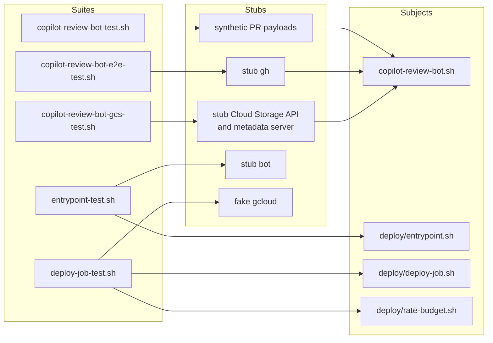

# Tests and local runs

For the developer who is about to change copilot-review-bot, or who has to explain a decision it
already made. It covers the five suites, the stubs they run against, and how to drive the bot by
hand.

The rules themselves are in [../README.md](../README.md). Production is in
[../deploy/README.md](../deploy/README.md). `run`, `tick`, `PR` and `state root` each mean one thing
throughout: see [Words used here](../README.md#words-used-here).

## Run them

Every suite finds its own subject, so all five run from anywhere:

```bash
tests/copilot-review-bot-test.sh        # the decision rules
tests/copilot-review-bot-e2e-test.sh    # the bot, end to end, against a stub gh
tests/copilot-review-bot-gcs-test.sh    # the gs:// state backend
tests/entrypoint-test.sh                # deploy/entrypoint.sh
tests/deploy-job-test.sh                # deploy/deploy-job.sh and deploy/rate-budget.sh
```

Each one prints its own pass and fail totals, and exits 1 if anything failed.

No suite needs a GitHub token, a network, a bucket, or any GCP credential. Two need more than bash and
`jq`. `copilot-review-bot-e2e-test.sh` needs `flock`, which is not stock on macOS, because a local
state root locks with it. `copilot-review-bot-gcs-test.sh` needs `curl` and `python3` for its stub
server, and it skips itself, loudly, without `python3`. The `test` job in
[`copilot-review-bot.yml`](../../.github/workflows/copilot-review-bot.yml) runs all five on every
push and pull request touching `copilot-review-bot/`, and asserts `python3` is present so that skip
cannot pass silently in CI.

Set `SUITE_VERBOSE=1` to print the log of a failing scenario. A GitHub Actions run re-run with debug
logging sets `RUNNER_DEBUG`, which has the same effect.

## Which suite covers what



| Suite                            | Subject                                            | What it proves                                                                                                                                                                                                                                        |
| -------------------------------- | -------------------------------------------------- | ----------------------------------------------------------------------------------------------------------------------------------------------------------------------------------------------------------------------------------------------------- |
| `copilot-review-bot-test.sh`     | The decision rules                                 | Merge against non-merge commits, unresolved threads, all six `basis` values, pending requests, review thread ownership, the three `mergeable` states, and every mention case, including a restack regression using a real author/committer-date pair. |
| `copilot-review-bot-e2e-test.sh` | The whole bot                                      | What the bot actually did: which mutations it sent, what it logged, and what it exited with. Covers the per-run cap, the transient/permanent split, the reactions, option validation, the read-failure breaker, the run deadline, and the log shape.  |
| `copilot-review-bot-gcs-test.sh` | The `gs://` state backend                          | The lock, the only thing between two overlapping executions and a lost write. Covers create, conflict, stale break, both lost races, release, the state round trip, a missing bucket permission, and the metadata server path Cloud Run uses.         |
| `entrypoint-test.sh`             | `deploy/entrypoint.sh`                             | The flag mapping and the argument order, which is all the entrypoint can get wrong. A mistake there means no bot ran, or one ran with the wrong flags.                                                                                                |
| `deploy-job-test.sh`             | `deploy/deploy-job.sh` and `deploy/rate-budget.sh` | The `gcloud` commands each would run: the create and update paths, the replaced environment set, the `jobs.json` schema, the quota arithmetic, and the timeout ordering.                                                                              |

`test-lib.sh` holds what all five need identically: the bash 4.4 floor, locating the subject,
building the tool `PATH`, the assertions, the call and event readers, and the log-shape check. It is
sourced, never executed.

## How the stubs work

Rules shared by every suite, and what make the results repeatable:

1. **`PATH` is rebuilt from scratch.** `build_tool_path` in `test-lib.sh` locates each tool it needs
   and puts the stub directory first, so a stub cannot be bypassed and a macOS machine gets its
   Homebrew bash rather than `/bin/bash` 3.2.
2. **The environment is wiped with `env -i`.** A `DRY_RUN`, a `GH_TOKEN` or a `STATE_DIR` already
   exported in your shell cannot reach the subject; each suite passes through an explicit allow-list
   instead.
3. **One stub per external service.** Nothing reaches the network.
4. **The subject is the real file.** No suite copies or patches the bot.
5. **Retry backoff is 0.** Both `GH_RETRY_BASE_SECONDS` and `GCS_RETRY_BASE_SECONDS` are set to 0 in
   the suite that exercises them, since every assertion is on the retry having happened and none on
   how long it waited.

The bot has three variables that exist only so a stub can be substituted. They default to the real
endpoints, so nothing has to be set in production:

| Variable            | Default                           | Substituted by                              |
| ------------------- | --------------------------------- | ------------------------------------------- |
| `GITHUB_API_ROOT`   | `https://api.github.com`          | The anonymous access probe in the e2e suite |
| `GCS_API_ROOT`      | `https://storage.googleapis.com`  | The stub Cloud Storage JSON API             |
| `GCS_METADATA_ROOT` | `http://metadata.google.internal` | The stub instance metadata server           |

`entrypoint.sh` has `BOT` for the same reason, and `deploy-job.sh` has `GCLOUD`. Setting
`GCLOUD=echo` prints the commands a real deployment would run.

The stub `gh` dispatches on the GraphQL document it is handed, answers from fixture files, and
appends one line per call to `calls.log`, so the suite asserts on the mutations that were actually
sent rather than on what the bot claims it sent. The stub Cloud Storage server implements only what
the bot uses, but implements `ifGenerationMatch` on create and delete faithfully, since that
precondition is what turns the lock object into a mutex.

## Add a case

Extend the matching suite before you change a rule.

* A change to the decision rules belongs in `copilot-review-bot-test.sh`, as a payload plus the
  fields it must produce. It runs through `--explain`, so it needs no stub.
* A change to what counts as a mention belongs there too. Each of the four exclusions (block quote,
  fenced block, indented block, inline code span) has a case; a fifth kind of text needs a fifth
  case.
* A change to what the bot *does* with a decision belongs in `copilot-review-bot-e2e-test.sh`,
  asserted through `calls()`, `events()` and the exit status.
* A change to the lock or the state object belongs in `copilot-review-bot-gcs-test.sh`.
* A change to `jobs.json`, its schema or the quota arithmetic belongs in `deploy-job-test.sh`, which
  already asserts that the checked-in `jobs.json` passes both scripts, so a new field needs a case
  there and in the schema.

Scenario names read as sentences, for example `== a secondary rate limit is a 403 but still
transient ==`. Keep that form; the name is what a reader sees when the assertion fails in CI.

## Debug one PR with `--explain`

`--explain FILE` runs the decision rules over a saved `pullRequest` object and prints the result. It
changes nothing and needs no token, so it is the tool for a post-mortem on a PR that behaved
unexpectedly.

1. Capture the object once. The query is the `Q_PR` variable in the bot.
2. Save it as `pr.json`.
3. Run `./copilot-review-bot.sh --explain pr.json`.

It prints the decision fields, then the mentions it would answer. Two variables exist only for this
mode, useful when the question is about a mention rather than a commit:

| Variable        | Default     | Meaning                                                                |
| --------------- | ----------- | ---------------------------------------------------------------------- |
| `VIEWER_LOGIN`  | `xrplf-bot` | The account whose own comments are skipped                             |
| `MENTION_SINCE` | the epoch   | The age cutoff, so every comment in the payload is in scope by default |

## Run the bot by hand

Start with `--verbose --dry-run`. Verbose mode logs the raw `gh` error for every failed query, and
the reason for every PR it skips.

```bash
./copilot-review-bot.sh --help
./copilot-review-bot.sh -v -n --repo <owner>/<name>
./copilot-review-bot.sh -v --repo <owner>/<name> --pr <number>   # one PR, fewer queries
```

The bot is a plain one-shot with no Cloud Run dependency, so cron works too. Use a local state root
there, since a local filesystem persists:

```cron
*/15 * * * * GH_TOKEN=ghp_... STATE_DIR=$HOME/.local/state/copilot-review-bot \
  /opt/copilot-review-bot/copilot-review-bot.sh --repo <owner>/<name> \
  >> /var/log/copilot-review-bot.log 2>&1
```

One entry per watched repository. They can share that state root. Put a second entry on a different
minute, so the two stay off each other's toes on the rate limit.

macOS works for testing, with two caveats: put a Homebrew bash first on `PATH`, since `/bin/bash` is
still 3.2, and run `brew install flock`, since a local state root locks with `flock`. BSD `date`
needs nothing; the flavor is probed at startup.

### Never point a live local run at the production state root

A real run takes the lock before it evaluates any PR, so a local run against the production prefix
takes the lock the scheduled job needs and deletes it on release. Every tick in the meantime logs
`run.skipped`.

`--dry-run` is exempt, since it takes no lock, local or `gs://`, and is safe to point at the
production prefix by hand. It is not free, though: a dry run reads every open PR, which can be a
meaningful slice of the hourly quota the scheduled fleet is already drawing on. Prefer `--pr N` when
one PR is the question, and see [A dry run measures the
backlog](../README.md#a-dry-run-measures-the-backlog-it-does-not-preview-the-next-run) for what its
two counts mean.

For a live test of the `gs://` path, use a scratch prefix such as
`gs://<bucket>/scratch-<yourname>`, and supply `GOOGLE_OAUTH_ACCESS_TOKEN` explicitly. The bot will
not silently authenticate as whoever is logged in to `gcloud`.

The prefix is optional, and the deployed jobs leave it out, so `gs://<bucket>` **is** the production
state root. Adding a segment of your own puts your lock and markers somewhere no scheduled job looks.

## What no test here can prove

Every suite stubs `requestReviewsByLogin`, so no suite reaches the one mutation that matters. See
[Asking Copilot, by name](../README.md#asking-copilot-by-name) for what that leaves unverified. The
only way to check it is to watch a real request land.

## Related documents

* [../README.md](../README.md) - what the bot does, its options, and what it logs.
* [../deploy/README.md](../deploy/README.md) - how it runs in production, and who may change it.
* [../../CONTRIBUTING.md](../../CONTRIBUTING.md) - hooks, branches, and adding a tool.
